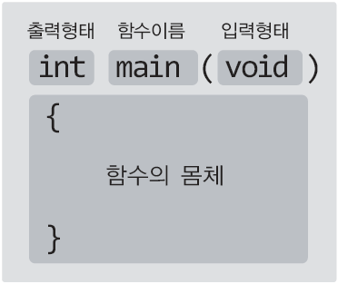

# **Chapter 02 프로그램의 기본구성**
> ## 02-1 Hello world! 들여다보기
### <center>"C언어는 함수로 시작해서 함수로 끝난다"</center>

* **함수**  
: 적절한 입력과 그에 따른 출력이 존재하는 것
* **함수의 정의**  
: 만들어진 함수, 실행이 가능한 함수를 일컬음
* **함수의 호출**  
: 함수의 실행을 명령하는 행위
* **인자**  
: 함수의 호출을 위해서 전달되는 값
* **main 함수**  
: 제일 먼저 호출되는 함수  
    &nbsp; C언어로 구현된 모든 프로그램에는 main함수가 정의되어야 함
* **함수의 이름**  
: 함수를 호출할 때 사용하게 되는 이름
* **출력형태**  
: 실행의 결과  
&nbsp; 일반적으로 반환형(return type)이라 한다
* **입력형태**  
: 함수를 호출할 때 전달하는 입력 값의 형태

<br>

  
&nbsp; &nbsp; &nbsp; &nbsp; &nbsp; &nbsp; &nbsp; &nbsp; &nbsp; &nbsp; &nbsp; &nbsp; &nbsp; &nbsp; &nbsp; <sup>함수 정의의 전체적인 구조 <sup>
* `int main(void)`  
: 출력형태가 int이고 입력형태가 void인 main이라는 이름의 함수
* 함수의 특성(입력형태, 출력형태, 함수이름)만 정의했다고 해서 함수가 되는 것이 아니라 기능을 지녀야 함  
    함수의기능은 중괄호 안에 표현됨  
    중괄호 내에 존재하는 문장은 위에서 아래로 순차적으로 실행됨
* **함수의 몸체**  
    : 함수의 기능을 정의하고 있는 영역  
    &nbsp; (중괄호 안에 포함된 함수의 기능)

```c
#include <stdio.h>
int main(void)
{
    printf("Hello world! \n");
    return 0;
}
```

* 함수 내에 존재하는 문장의 끝에는 **세미콜론(;)** 을 붙여준다  
    (조건문이나 반복문과 같은 컨트롤 문장에는 붙지 않음)
*  **표준함수**  
: 기본적으로 제공되는 함수(printf는 표준함수에 해당)
* **표준 라이브러리**  
: 표준함수들의 모임
* `#include <stdio.h>`  
\- 헤더파일 선언문  
\- stdio.h 파일의 내용을 이 위치에 가져다 놓으라는 뜻  
\- printf 함수의 호출에 필요한 정보가 존재  
\- printf 함수의 호출을 위해는 stdio.h를 대상으로 헤더파일을 선언해야 함  
\- 헤더파일의 선언은 소스파일의 맨 앞부분, main함수 정의 이전에 와야 함
* `printf("Hello world! \\n");`  
\- printf라는 이름의 함수를 호출하는 문장  
\- 인자는 문자열 "Hello world! \\n"  
\- C언어는 큰따옴표를 이용해서 문자열 표현  
\- 인자는 소괄호를 통해서 해당 함수에 전달 됨  
\- \\n은 줄바꿈을 의미  
&nbsp; (이스케이프시퀀스(escape sequence)(특수문자) 중 하나로 줄을 바꾸라는(개행하라는) 의미로 사용)
* `return 0;`  
\- 함수를 호출한 영역으로 값을 전달(반환)  
\- 현재 실행중인 함수의 종료

##### 참고) &nbsp; main함수의 마지막에서 0을 전달(반환)하는 이유 <br> &nbsp; &nbsp; &nbsp; &nbsp; &nbsp; \- 0이 운영체제에 전달되는데 그 값은 프로그램의 종료 상태를 알리는 데 사용됨 <br> &nbsp; &nbsp; &nbsp; &nbsp; &nbsp; \- 보통 0은 정상적인 종료의 상황에서 전달하는 값임 <br> &nbsp; &nbsp; &nbsp; &nbsp; &nbsp; &nbsp; (비정상적인 상황으로 인해 종료될 때는 일반적으로 0이 아닌 값을 전달함)

<br>

> ## 문제 02-1 \[예제 변경해보기\]

문제1
```c
#include <stdio.h>
int main(void)
{
    printf("홍길동\n홍 길 동\n홍  길  동\n");
    return 0;
}
```

문제2

```c
#include <stdio.h>
int main(void)
{
    printf("이름: 권예진\n");
    printf("주소: 인천광역시 부평구\n");
    printf("전화번호: 010-xxxx-xxxx\n");
    return 0;
}
```

> ## 주석이 들어가야 완성된 프로그램

### <center> "주석은 선택이 아닌 필수!" </center>

* **주석**  
: 컴파일 대상에서 제외되는, 프로그램 내에 삽입된 메모

```c
/*
제목: Hello world 출력하기
기능: 문자열의 출력
파일이름: HelloComment.c
수정날짜: 2021.07.30
작성자: 권예진
*/
#include <stdio.h>    // 헤더파일 선언
int main(void)    // main 함수의 시작
{
    /*
    이 함수 내에서는 하나의 문자열을 출력한다.
    문자열은 모니터로 출력된다.
    */
    printf("Hello world! \n");    // 문자열의 출력
    return 0;    // 0의 반환
}    // main 함수의 끝
```

* **블록 단위 주석**  
: 주석의 시작은 /\* 으로 명시, 주석의 끝은 \*/ 으로 명시  
&nbsp; /\* _주석처리 된 문장_ &nbsp;\*/  
&nbsp; /\*  
&nbsp; &nbsp; &nbsp; &nbsp; _주석처리 된 문장1_  
&nbsp; &nbsp; &nbsp; &nbsp;_주석처리 된 문장2_  
&nbsp; &nbsp; &nbsp; &nbsp;_주석처리 된 문장3_  
&nbsp; \*/
* **행 단위 주석**  
: // 뒤에 등장하는 문장은 주석으로 처리  
&nbsp; // _주석처리 된 문장1_  
&nbsp; // _주석처리 된 문장2_  
&nbsp; // _주석처리 된 문장3_
* **주석처리에 있어서의 주의점**  
\- 블록 단위 주석은 중첩될 수 없음  
\- 행 단위 주석은 블록 단위 주석의 내부에 포함될 수 있음
---------
1\. /\*  
2.&nbsp; &nbsp; &nbsp;_주석처리 된 문장1_  
3.&nbsp; &nbsp; &nbsp;/\* _단일 행 주석처리_ \*/  
4.&nbsp; &nbsp; &nbsp;_주석처리 된 문장2_  
5\. \*/  
  
주석이 시작되면 \*/ 을 만나는 곳까지 주석으로 처리되는데,  
3행에서 \*/을 만나기 때문에 2행과 3행만 주석 처리되어 오류 발생
  
1\. /\*  
2.&nbsp; &nbsp; &nbsp;_주석처리 된 문장1_  
3.&nbsp; &nbsp; &nbsp;// _단일 행 주석처리_  
4.&nbsp; &nbsp; &nbsp;_주석처리 된 문장2_  
5\. \*/  
  
이처럼 블록 단위 주석 내부에 행 단위 주석 삽입은 가능

-------
<br>

> ## 02-3 printf 함수의 기본적인 이해

```c
#include <stdio.h>
int main(void)
{
    printf("Hello Everybody\n");
    printf("%d\n", 1234);
    printf("%d %d\n", 10, 20);
    return 0;
}
```
```
[실행결과]  
Hello Everybody  
1234  
10 20
```

* `%d`  
: 서식문자에 해당  
&nbsp; (%d는 부호가 있는 10진수 정수의 형태로 출력하라는 의미)
-   **서식문자**  
: 출력의 형태를 지정하는 용도로 사용  
\- 서식문자의 개수와 출력의 대상의 개수는 동일해야 함
* 서식문자의 출력의 대상은 첫 번째 인자 다음에 오는 인자를 순서대로 출력함 (콤마로 인자를 구분함)  
\- 5행에서 첫 번째 인자는 "%d\\n"이고 두 번째 인자는 1234임. 따라서 "1234\\n"을 출력  
\- 6행에서 첫 번째 인자는 "%d %d\\n"이고 두 번째 인자는 10, 세 번째 인자는 20임. 따라서 "10 20\\n"을 출력
* 숫자가 와야 할 위치에 연산문이 올 수도 있음 (연산의 결과가 숫자를 대신함)  
(아래 문제2의 5행 참고)

<br>

> ## 문제 02-2 \[printf 함수의 다양한 활용\]

문제1

```c
#include <stdio.h>
int main(void)
{
    printf("제 이름은 홍길동입니다.\n");
    printf("제 나이는 %d살이고요.\n", 20);
    printf("제가 사는 곳의 번지수는 %d-%d입니다.\n", 123, 456);
    return 0;
}
```

문제2

```c
#include <stdio.h>
int main(void)
{
    printf("%dx%d=%d\n", 4, 5, 20);
    printf("%dx%d=%d\n", 7, 9, 7*9);
    return 0;
}
```
<br>
<br>
<br>
<br>
<br>
출처: 윤성우의 열혈 C 프로그래밍
