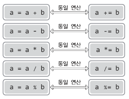

# **Chapter 03 변수와 연산자**
> ## 03-1 연산을 위한 연산자와 값의 저장을 위한 변수

```c
#include <stdio.h>
int main(void)
{
    3 + 4;    //3과 4의 합을 명령함
    return 0;
}
```

위 코드는 문제없이 컴파일 되지만 덧셈의 결과가 출력되지는 않는다.  
프로그램 내에 덧셈을 요구하는 문장은 있지만 출력을 요구하는 문장은 없기 때문이다.  
따라서 덧셈 연산을 하고 그 결과를 메모리 공간에 저장한 후 저장된 값을 출력하는 과정이 필요하다.  
이때 **변수**를 사용한다.

* **연산자**  
: 특정 연산을 요구할 때 사용하는 약속된 기호
* **변수**  
: 값을 저장할 수 있는 메모리 공간에 붙은 이름, 혹은 메모리 공간 자체  
\- 변수를 선언하면 메모리 공간이 할당되고 할당된 메모리 공간에 이름이 붙음  
\- 변수를 선언하면 그 변수의 이름을 통해 값의 저장 및 참조가 가능하고, 저장된 값의 변경도 가능

<br>

```c
in main(void)
{
    int num;             // num이라는 이름의 변수 선언
    num = 20;            // 변수 num에 20 저장
    printf("%d", num)    // 변수 num의 값 참조
    ····
}
```

* `int num;`  
\- int : 정수의 저장이 가능한 메모리 공간 할당  
\- num : 할당된 메모리 공간의 이름은 num
* `num = 20;`  
\- 변수 num에 접근하여 20을 저장  
\- C언어에서 = 기호는 값의 대입을 뜻함 ('대입 연산자' 라고 함)  
\- 대입 연산자의 오른편에 오는 값을 왼편에 오는 변수에 저장하는 형태로 사용

<br>

```c
#include <stdio.h>
in main(void)
{
    int num1, num2;              // 변수 num1, num2의 선언
    int num3 = 30, num4 = 40;    // 변수 num3, num4의 선언 및 초기화
    int result = num3 + num4;    // 변수 result의 선언 및 초기화
    
    printf("num1: %d, num2: %d \n", num1, num2);
    
    num1 = 10;    // 변수 num1의 초기화
    num2 = 20;    // 변수 num2의 초기화
    
    printf("num1: %d, num2: %d \n", num1, num2);
    printf("num3: %d, num4: %d \n", num3, num4);
    printf("result: %d", result);
    
    return 0;
}
```
```
[실행결과]  
num1: -858993460, num2: -858993460  
num1: 10, num2: 20  
num3: 30, num4: 40  
result: 70
```

* **초기화**  
: 선언된 변수에 처음 값을 저장하는 것  
(초기화 이후에 저장된 값을 변경할 때에는 '대입' 또는 '대입연산'을 진행한다고 함)
* `int num1, num2;`  
\- 변수를 선언만 할 수 있음  
\- 콤마를 이용하여 둘 이상의 변수를 동시에 선언  
\- 변수를 선언만 하고 초기화하지 않으면 값이 대입되기 전까지 의미없는 값이 저장됨  
&nbsp; &nbsp; (∴ 실행결과 첫 번째 줄에 이상한 숫자가 나옴)
* `int num3 = 30, num4 = 40;`  
\- 선언과 동시에 초기화
* `int result = num3 + num4;`  
\- 선언과 동시에 덧셈의 연산결과로 초기화
* **변수 이름 규칙**  
\- 변수의 이름은 알파벳, 숫자, 언더바(\_)로 구성됨  
\- C언어는 대소문자를 구분함 (변수 Num과 변수 num은 다른 변수)  
\- 변수의 이름은 숫자로 시작할 수 없음  
\- 키워드를 변수 이름으로 사용할 수 없음 (키워드는 int, return 등 그 기능적 의미가 정해져 있는 단어)  
\- 이름 사이에 공백이 삽입될 수 없음  
    
    ```c
    /* 유효하지 않은 변수 선언문 */
    int 7ThVal;       // 변수의 이름이 숫자로 시작
    int phone#;       // 변수의 이름에 #과 같은 특수문자는 올 수 없음
    int your name;    // 변수의 이름에 공백이 올 수 없음
    ```
    
* 중괄호 내에 변수를 선언할 경우, **변수의 선언문은 중괄호의 앞부분**에 위치해야 함  
    
    ```c
    /* 컴파일이 불가능할 수 있는 변수 선언 */
    int main(void)
    {
        int num1;
        num1 = 0;
        int num2;
        num2 = 0;
        ····
    }
    ```
    
* **변수의 자료형**    
    | | 정수형 변수 | 실수형 변수 |
    | --- | --- | --- |
    | 의미 | 정수 값의 저장을 목적으로 선언된 변수 | 실수 값의 저장을 목적으로 선언된 변수 |
    | 종류 | char | float |
    |   | short | double |
    |   | int |  |
    |   | long |  |
    
<br>

> ## 03-2 C언어의 다양한 연산자 소개

* **대입 연산자(=)와 산술 연산자(+, -, \*, /, %)**  
    
    | 연산자 | &nbsp; &nbsp; &nbsp; &nbsp; &nbsp; &nbsp; &nbsp; &nbsp; &nbsp; &nbsp; &nbsp; &nbsp; &nbsp; &nbsp; &nbsp; &nbsp; &nbsp; &nbsp; &nbsp; &nbsp; &nbsp; 연산자의 기능 | 결합방향 |
    | :---: | --- | :---: |
    | \= | 연산자의 오른쪽에 있는 값을 연산자 왼쪽에 있는 변수에 대입 <br>예) num = 20; | ← |
    | + | 두 피연산자의 값을 더함 <br> 예) num = 4 + 3; | → |
    | \- | 왼쪽의 피연산자 값에서 오른쪽의 피연산자 값을 뺌 <br> 예) num = 4 - 3; | → |
    | \* | 두 피연산자의 값을 곱함 <br> 예) num = 4 \* 3; | → |
    | / | 왼쪽의 피연산자 값을 오른쪽의 피연산자 값으로 나눔 <br> 예) num = 7 / 3; | → |
    | % | 왼쪽의 피연산자 값을 오른쪽의 피연산자 값으로 나눈 나머지 반환 <br> 예) num = 7 % 3; | → |
    

* **복합 대입 연산자 (\*=, /=, %=, +=, -=, <<=, >>=, &=, ^=, |=)**  
    
* **부호연산의 의미를 갖는 +연산자와 -연산자**  
\- + 연산자와 - 연산자는 부호를 뜻하기도 함
* **증가, 감소 연산자**  
    | 연산자 | &nbsp; &nbsp; &nbsp; &nbsp; &nbsp; &nbsp; &nbsp; &nbsp; &nbsp; &nbsp; &nbsp; &nbsp; &nbsp; &nbsp; &nbsp; &nbsp; &nbsp; &nbsp; 연산자의 기능 | 결합방향 |
    | :---: | --- | :---: |
    | ++num | 값을 1 증가 후, 속한 문장의 나머지를 진행 (선 증가, 후 연산) <br> 예) val = ++num; | ← |
    | num++ | 속한 문장을 먼저 진행한 후, 값을 1 증가 (선 연산, 후 증가) <br> 예) val = num++; | → |
    | \--num | 값을 1 감소 후, 속한 문장의 나머지를 진행 (선 감소, 후 연산) <br> 예) val = --num; | ← |
    | num-- | 속한 문장을 먼저 진행한 후, 값을 1 감소 (선 연산, 후 감소) <br> 예) val = num--; | → |
    
    ```c
    #include <stdio.h>
    int main(void)
    {
        int num1 = 12;
        int num2 = 12;
        
        printf("num1: %d \n", num1);
        printf("num1++: %d \n", num1++);    // 후위 증가
        printf("num1: %d \n\n", num1);
        
        printf("num2: %d \n", num2);
        printf("++num2: %d \n", ++num2);    // 전위 증가
        printf("num2: %d \n", num2);
        
        return 0;
    }
    ```
    
    ```
    [실행결과]
    num1: 12
    num1++: 12
    num1: 13
    
    num2: 12
    ++num2: 13
    num2: 13
    ```
    
    ```c
    #include <stdio.h>
    int main(void)
    {
        int num1 = 10;
        int num2 = (num1--) + 2;    // 후위 감소
        
        printf("num1: %d \n", num1);
        printf("num2: %d \n", num2);
        
        return 0;
    }
    ```
    
    ``` 
    [실행결과]
    num1: 9
    num2: 12
    ```
    
    * 후위 증가 및 후위 감소 연산 시에는  
    **소괄호의 영향을 받지 않고, 다음 문장으로 넘어가야만 비로소 값의 증가 및 감소가 이루어진다.**

<br>

* **관계 연산자 (<, >, ==, !=, <=, >=)**  
: 대소와 동등의 관계를 따지는 연산자 ('비교 연산자'라고도 함)  
    | 연산자 | &nbsp; &nbsp; &nbsp; &nbsp; &nbsp; &nbsp; 연산자의 기능 | 결합방향 |
    | :---: | --- | :---: |
    | < | 예) n1 < n2 <br> n1이 n2보다 작은가? | → |
    | \> | 예) n1 > n2 <br> n1이 n2보다 큰가? | → |
    | \== | 예) n1 == n2 <br> n1과 n2가 같은가? | → |
    | != | 예) n1 != n2 <br> n1과 n2가 다른가? | → |
    | <= | 예) n1 <= n2 <br> n1이 n2보다 같거나 작은가? | → |
    | \>= | 예) n1 >= n2 <br> n1이 n2보다 같거나 큰가? | → |
    
    * 관계연산자는 조건을 만족하면 참(true)을, 만족하지 않으면 거짓(false)을 반환  
    (참(true)은 1, 거짓(false)은 0으로 표현)  

    <br>

    ```c
    #include <stdio.h>
    int main(void)
    {
        int num1 = 10;
        int num2 = 12;
        int result1, result2, result3;
        
        result1 = (num1 == num2);
        result2 = (num1 <= num2);
        result3 = (num1 > num2);
        
        printf("result1: %d \n", result1);
        printf("result2: %d \n", result2);
        printf("result3: %d \n", result3);
        
        return0;
    }
    ```
    
    ```
    [실행결과]
    result1: 0
    result2: 1
    result3: 1
    ```

* **논리연산자 (&&, ||, !)**  
: AND(논리곱), OR(논리합), NOT(논리부정)을 표현하는 연산자  
    | 연산자 | &nbsp; &nbsp; &nbsp; &nbsp; &nbsp; &nbsp; &nbsp; &nbsp; &nbsp; &nbsp; &nbsp; &nbsp; &nbsp; &nbsp; &nbsp; &nbsp; &nbsp; &nbsp; &nbsp; &nbsp; 연산자의 기능 | 결합방향 |
    | :---: | --- | :---: |
    | && | 예) A && B <br> A와 B 모두 '참'이면 연산결과로 '참'을 반환 (논리 AND) | → |
    | \|\| | 예) A \|\| B <br> A와 B 둘 중 하나라도 '참'이면 연산결과로 '참'을 반환 (논리 OR) | → |
    | ! | 예) !A <br> A가 '참'이면 '거짓', A가 '거짓'이면 '참'을 반환 (논리 NOT) | ← |

    ```c
    #include <stdio.h>
    int main(void)
    {
        int num1 = 10;
        int num2 = 12;
        int result1, result2, result3;
        
        result1 = (num1==10 && num2==12);
        result2 = (num1<12 || num2>12);
        result3 = (!num1);
        
        printf("result1: %d \n", result1);
        printf("result2: %d \n", result2);
        printf("result3: %d \n", result3);
        
        return 0;
    }
    ```
    
    ```
    [실행결과]
    result1: 1
    result2: 1
    result3: 0
    ```
    
    * 논리 연산자보다 관계 연산자가 먼저 진행됨 (result1, result2)  
    C언어는 0이 아닌 모든 값을 참(true)으로 간주 (∴ num1은 참이므로 result3는 0 반환)

<br>

* **콤마 연산자 (,)**  
\- 둘 이상의 변수를 동시에 선언하거나, 둘 이상의 문장을 한 행에 삽입하는 경우에 사용  
\- 둘 이상의 인자를 함수로 전달할 때 인자의 구분을 목적으로 사용  
\- 다른 연산자들과 달리 연산의 결과가 아닌 '구분'을 목적으로 사용
* **연산자의 우선순위와 결합방향**  
\- 우선순위: 연산의 순서에 대한 순위 (덧뺄셈보다 곱셈나눗셈의 우선순위가 높음)  
\- 결합방향: 우선순위가 동일한 두 연산자 사이에서 연산을 진행하는 방향  
&nbsp; &nbsp; &nbsp; &nbsp; &nbsp; &nbsp; &nbsp; &nbsp; &nbsp; (덧셈, 뺄셈, 곱셈, 나눗셈은 왼쪽에서 오른쪽으로 연산 진행)  
    | 순위 | 연산기호 | 연산자 | 결합방향 |
    | :---: | :---: | :---: | :---: |
    | 1위 | ( ) | 함수호출 | → |
    |    | \[ \] | 인덱스 | → |
    |    | \-> | 간접지정 | → |
    |    | . | 직접지정 | → |
    |    | ++ (postfix) <br> \-- (postfix) | 후위증가 및 감소 | → |
    | 2위 | ++ (prefix)   \-- (prefix) | 전위증가 및 감소 | ← |
    |    | sizeof | 바이트 단위 크기 계산 | ← |
    |    | ~ | 비트 단위 NOT | ← |
    |    | ! | 논리 NOT | ← |
    |    | \-, + | 부호 연산 (음수와 양수 표현) | ← |
    |    | & | 주소 연산 | ← |
    |    | \* | 간접지정 연산 | ← |
    | 3위 | (casting) | 자료형 변환 | ← |
    | 4위 | \*, /, % | 곱셈, 나눗셈 관련 연산 | → |
    | 5위 | +, - | 덧셈, 뺄셈 | → |
    | 6위 | <<, >> | 비트이동 | → |
    | 7위 | <, >, <=, >= | 대소비교 | → |
    | 8위 | \==, != | 동등비교 | → |
    | 9위 | & | 비트 AND | → |
    | 10위 | ^ | 비트 XOR | → |
    | 11위 | \| | 비트 OR | → |
    | 12위 | && | 논리 AND | → |
    | 13위 | \|\| | 논리 OR | → |
    | 14위 | ?: | 조건연산 | ← |
    | 15위 | \=, +=, -=, \*=, /=, %=, <br> <<=, >>=, &=, ^=, \|= | 대입연산 | ← |
    | 16위 | , | 콤마연산 | → |
    
<br>

> ## 03-3 키보드로부터의 데이터 입력과 C언어의 키워드

```c
int main(void)
{
    int num;
    scanf("%d", &num);    // 키보드로 입력된 정수를 변수 num에 저장하라
    scanf("%d %d %d", &num1, &num2, &num3);
    ····
}
```

* `scanf`  
: 키보드로부터 데이터를 입력받는 함수
* `%d`  
: 서식문자에 해당  
&nbsp; (scanf에서의 %d는 10진수 정수형태의 입력을 의미)
* `&num`  
    : 입력받은 값을 변수 num에 저장하라는 의미  
&nbsp; (& 연산자가 붙은 이유는 다음에...)
* **scanf 함수는 공백을 기준으로 데이터를 구분**하므로,  
    5행에 있는 3개의 정수 사이에 공백에 해당하는 스페이스바, 탭(tab), 또는 엔터(enter)키를 입력해야 함
* 한 번의 scanf 함수 호출을 통해서 여러 개의 데이터를 다양한 형태로 입력받을 수 있음  
    (서식문자를 변경하여 데이터의 유형(형태)도 달리할 수 있음)

<br>

> ## 문제 03-1 \[scanf 함수의 활용\]

문제1
```c
#include <stdio.h>
int main(void)
{
    int num1, num2;
    printf("정수 2개 입력: ");
    scanf("%d %d", &num1, &num2);
    printf("뺄셈: %d \n", num1-num2);
    printf("곱셈: %d \n", num1*num2);
    
    return 0;
}
```

문제2
```c
#include <stdio.h>
int main(void)
{
    int num1, num2, num3;
    printf("정수 3개 입력: ");
    scanf("%d %d %d", &num1, &num2, &num3);
    printf("%d * %d + %d = %d \n", num1, num2, num3, num1*num2+num3);
    
    return 0;
}
```

문제3
```c
#include <stdio.h>
int main(void)
{
    int num;
    printf("정수 1개 입력: ");
    scanf("%d", &num);
    printf("제곱: %d \n", num*num);
    
    return 0;
}
```

문제4
```c
#include <stdio.h>
int main(void)
{
    int num1, num2;
    printf("정수 2개 입력: ");
    scanf("%d %d", &num1, &num2);
    printf("몫: %d \n", num1/num2);
    printf("나머지: %d \n", num%num2);
    
    return 0;
}
```

문제5
```c
#include <stdio.h>
int main(void)
{
    int num1, num2, num3, result;
    printf("정수 3개 입력: ");
    scanf("%d %d %d", &num1, &num2, &num3);
    result = (num1-num2)*(num2+num3)*(num3%num1);
    printf("결과 = %d \n", result);
    
    return 0;
}
```
<br>
<br>
<br>
<br>
<br>
출처: 윤성우의 열혈 C 프로그래밍
