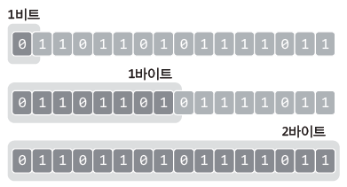

# **Chapter 04 데이터 표현방식의 이해**
> ## 04-1 컴퓨터가 데이터를 표현하는 방식

* **n진수**  
: n 개의 기호를 이용해 값(데이터)를 표현하는 방식 (숫자도 기호에 포함)  


&nbsp; &nbsp; &nbsp; &nbsp; &nbsp; <sup>숫자 기호는 10개밖에 없어서 16진법에는 문자도 동원 (문자 a는 정수 10, 문자 f는 정수 15 의미)

##### 참고) 2진수를 이용하면 길이가 너무 길어지기 때문에 16진수를 많이 사용 (∵ 2진수 네 개를 16진수 하나로 표현 가능)

<br>

> ## 문제 04-1 \[진법의 이해\]

문제1
```
10진수: 8 9, 10, 11, 12, 13, 14, 15, 16, 17, 18, 19, 20
2진수: 1000, 1001, 1010, 1011, 1100, 1101, 1110, 1111, 10000, 10001, 10010, 10011, 10100
16진수: 8, 9, A, B, C, D, E, F, 10, 11, 12, 13, 14
```

문제2
```
10진수: 5, 6, 7, 8, 9, 10, 11, 12, 13, 14, 15, 16, 17, 18
8진수: 5, 6, 7, 8, 10, 11, 12, 13, 14, 15, 16, 17, 20, 21, 22
```
<br>


* **비트 (Bit)**  
: 컴퓨터가 표현하는 데이터의 최소단위로서 2진수 값 하나를 저장할 수 있는 메모리 크기를 뜻하는 단위
* **바이트 (Byte)**  
: 비트를 8개 묶으면 '바이트'라는 단위가 구성됨

<br>

> ## 문제 04-2

문제1
```
4비트: 2^4개
1바이트: 2^8개
4바이트: 2^32개
```

문제2
```
00000001 = 1
00000010 = 2
00000100 = 4
00001000 = 8
00010000 = 16
00100000 = 32
01000000 = 64
10000000 = 128
```

문제3
```
00010001 = 17
10100010 = 162
11110111 = 247
```

<br>

---

<br>

* **8진수와 16진수를 이용한 데이터 표현**
    ```c
    int num1 = 10;     // 특별한 선언이 없으면 10진수의 표현
    int num2 = 0xA;    // 0x로 시작하면 16진수로 인식
    int num3 = 012;    // 0으로 시작하면 8진수로 인식
    ```
    
    표현 방식이 다르더라도 저장되는 값은 동일  
    (위의 세 문장에 의해서 변수에 초기화되는 값은 모두 10으로 동일)  
    
    ```c
    #include <stdio.h>
    int main(void)
    {
        int num1 = 0xA7, num2 = 0x43;
        int num3 = 032, num4 = 024;
        
        printf("0xA7의 10진수 정수 값: %d \n", num1);
        printf("0x43의 10진수 정수 값: %d \n", num2);
        printf("032의 10진수 정수 값: %d \n", num3);
        printf("024의 10진수 정수 값: %d \n", num4);
        
        printf("%d - %d = %d \n", num1, num2, num1-num2);
        printf("%d + %d = %d \n", num3, num4, num3+num4);
        
        return 0;
    }
    ```
    ```
    [실행결과]
    0xA7의 10진수 정수 값: 167
    0x43의 10진수 정수 값: 67
    032의 10진수 정수 값: 26
    024의 10진수 정수 값: 20
    167 - 67 = 100
    26 + 20 = 46
    ```
    서식문자 `%d`는 10진수 정수 형태 출력을 의미하므로 10진수 정수의 형태로 출력

<br>

> ## 04-2 정수와 실수의 표현방식

* **정수의 표현방식**  
\- 정수의 가장 왼쪽에 존재하는 비트를 **MSB(Most Significant Bit)** 라고 함  
\- MSB는 부호를 나타내는 비트임  
\- MSB를 제외한 나머지 비트는 데이터의 크기를 나타냄  
ex) 00000101 = +5
* 음의 정수를 표현할 때에는 2의 보수를 취해야 함  
\- MSB만 1로 바꾸어서는 음수가 표현되지 않음  
&nbsp; (&nbsp;∵&nbsp; (+5) + (-5) = 0이 되어야 하는데 00000101 + 10000101 = 10001010 ≠ 0)
* **2의 보수법**  
: 1의 보수를 취하고(1은 0으로, 0은 1로 바꿈) 1을 더하는 과정  
ex) +5 = 00000101 &nbsp; &nbsp; &nbsp; &nbsp;  -5 = 11111010+1 = 11111011
* **실수의 표현방식**  


&nbsp; &nbsp; &nbsp; &nbsp; &nbsp; - 넓은 범위의 실수를 표현할 수 있지만 오차 존재  
&nbsp; &nbsp; &nbsp; &nbsp; &nbsp; - (실수를 정확히 표현하지 못하고 근사치를 표현할 뿐)

<br>

> ## 문제04-3 \[음의 정수 표현하기\]

문제1
```
01001111 = 79
00110011 = 51
```

문제2
```
10101001 = -87    (2의 보수는 01010111)  
11110000 = -16    (2의 보수는 00010000)
```

<br>

> ## 04-3 비트 연산자

| 연산자 | &nbsp; 연산자의 기능 | 결합방향 |
| :---: | --- | :---: |
| & | 비트단위로 AND 연산을 한다 <br> 예) num1 & num2; | → |
| \| | 비트단위로 OR 연산을 한다 <br> 예 num1 \| num2; | → |
| ^ | 비트단위로 XOR 연산을 한다 <br> 예) num1 ^ num2; | → |
| ~ | 단항 연산자로서 피연산자의 모든 비트를 반전시킨다 <br> 예) ~num; &nbsp; &nbsp; &nbsp; &nbsp; // num은 변화 없음, 반전 결과만 반환 | ← |
| << | 피연산자의 비트 열을 왼쪽으로 이동시킨다 <br> 예) num<<2; &nbsp; &nbsp; &nbsp; &nbsp; // num은 변화 없음, 두 칸 왼쪽 이동 결과만 반환 | → |
| \>> | 피연산자의 비트 열을 오른쪽으로 이동시킨다 <br> 예) num>>2; &nbsp; &nbsp; &nbsp; &nbsp; // num은 변화 없음, 두 칸 오른쪽 이동 결과만 반환 | → |

* **& 연산자: 비트단위 AND**  
: 두 개의 비트가 모두 1일 때 1을 반환하는 연산  
&nbsp; - 0 & 0 &nbsp; &nbsp; &nbsp; &nbsp; 0을 반환  
&nbsp; - 0 & 1 &nbsp; &nbsp; &nbsp; &nbsp; 0을 반환  
&nbsp; - 1 & 0 &nbsp; &nbsp; &nbsp; &nbsp; 0을 반환  
&nbsp; - 1 & 1 &nbsp; &nbsp; &nbsp; &nbsp; 1을 반환
* **| 연산자: 비트단위 OR**  
: 두 개의 비트 중 하나라도 1이면 1을 반환하는 연산  
&nbsp; - 0 | 0 &nbsp; &nbsp; &nbsp; &nbsp; 0을 반환  
&nbsp; - 0 | 1 &nbsp; &nbsp; &nbsp; &nbsp; 1을 반환  
&nbsp; - 1 | 0 &nbsp; &nbsp; &nbsp; &nbsp; 1을 반환  
&nbsp; - 1 | 1 &nbsp; &nbsp; &nbsp; &nbsp; 1을 반환
* **^ 연산자: 비트단위 XOR**  
: 두 개의 비트가 서로 다른 경우에 1을 반환  
&nbsp; - 0 ^ 0 &nbsp; &nbsp; &nbsp; &nbsp; 0을 반환  
&nbsp; 0 ^ 1 &nbsp; &nbsp; &nbsp; &nbsp; 1을 반환  
&nbsp; 1 ^ 0 &nbsp; &nbsp; &nbsp; &nbsp; 1을 반환  
&nbsp; 1 ^ 1 &nbsp; &nbsp; &nbsp; &nbsp; 0을 반환
* **\~ 연산자: 비트단위 NOT**  
: 비트를 0에서 1로, 1에서 0으로 반전 (보수연산)  
&nbsp; - ~0 &nbsp; &nbsp; &nbsp; &nbsp; 1을 반환  
&nbsp; - ~1 &nbsp; &nbsp; &nbsp; &nbsp; 0을 반환
* **<< 연산자: 비트의 왼쪽 이동 (Shift)**  
\- num1 << num2 &nbsp; &nbsp; &nbsp; &nbsp; // num1의 비트 열을 num2칸씩 왼쪽으로 이동시킨 결과를 반환  
\- 8 << 2 &nbsp; &nbsp; &nbsp; &nbsp; &nbsp; &nbsp; &nbsp; &nbsp; &nbsp; &nbsp; &nbsp; //정수 8의 비트 열을 2칸씩 왼쪽으로 이동시킨 결과를 반환
* **\>> 연산자: 비트의 오른쪽 이동 (Shift)**  
\- 양수를 이동시킬 때에는 이동으로 인해서 생긴 왼쪽의 빈 자리는 0으로 채워짐  
\- 음수를 이동시킬 때에는 CPU에 따라 결과가 다름  
&nbsp; (음의 값을 유지하기 위해 1을 채우기도 하고 음의 값 유지와 상관 없이 0을 채우기도 함)

```c
#include <stdio.h>
int main(void)
{
    int num1 = 15;    // 00001111
    int num2 = 20;    // 00010100
    int num = -16;    // 11110000
    int num3 = num1 & num2;    // 00000100
    int num4 = num1 | num2;    // 00011111
    int num5 = num1 ^ num2;    // 00011011
    int num6 = ~num1;          // 11110000
    int num7 = num1<<1;        // 00011110
    int num8 = num1<<2;        // 00111100
    int num9 = num1<<3;        // 01111000
    int num10 = num>>2;        // 00111100 또는 11111100
    int num11 = num>>3;        // 00011110 또는 11111110
    
    printf("AND 연산의 결과: %d \n", num3);
    printf("OR 연산의 결과: %d \n", num4);
    printf("XOR 연산의 결과: %d \n", num5);
    printf("NOT 연산의 결과: %d \n", num6);
    printf("1칸 왼쪽 이동 결과: %d \n", num7);
    printf("2칸 왼쪽 이동 결과: %d \n", num8);
    printf("3칸 왼쪽 이동 결과: %d \n", num9);
    printf("2칸 오른쪽 이동 결과: %d \n", num10);
    printf("3칸 오른쪽 이동 결과: %d \n", num11);
    
    return 0;
}
```

```
[실행결과]
AND 연산의 결과: 4
OR 연산의 결과: 31
XOR 연산의 결과: 27
NOT 연산의 결과: -16
1칸 왼쪽 이동 결과: 30
2칸 왼쪽 이동 결과: 60
3칸 왼쪽 이동 결과: 120
2칸 오른쪽 이동 결과: -4
3칸 오른쪽 이동 결과: -2
```
 
* 비트의 열을 왼쪽으로 1칸 이동시킬 때마다 정수의 값은 2배가 됨
*  비트의 열을 오른쪽으로 1칸씩 이동시킬 때마다 정수의 값은 2로 나누어짐

<br>

> ## 문제 04-4 \[비트연산의 이해\]

문제1
```c
#include <stdio.h>
int main(void)
{
    int num;
    printf("정수 입력: ");
    scanf("%d", &num);
    num = (~num)+1;
    printf("부호 바꾼 결과: %d \n", num);
    
    return 0;
}
```

문제2
```c
#include <stdio.h>
int main(void)
{
    int num = 3;
    num = num<<3;    // 곱하기 8
    num = num>>2;    // 나누기 4
    
    printf("연산 결과: %d \n", num);
    
    return 0;
}
```
<br>
<br>
<br>
<br>
<br>
출처: 윤성우의 열혈 C 프로그래밍
