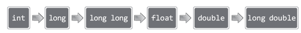
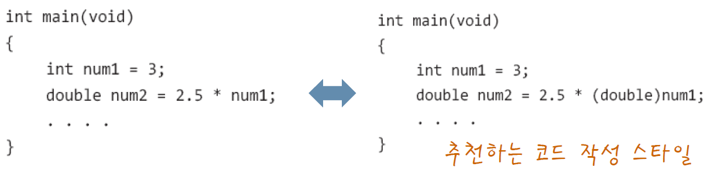

# **Chapter 05 상수와 기본 자료형**
> ## 05-1 C언어가 제공하는 기본 자료형의 이해

| 자료형 | 자료형 | 크기 | 값의 표현범위 |
| --- | --- | --- | --- |
| 정수형 | char | 1 바이트 | \-(2^7) 이상 (2^7 -1) 이하 &nbsp; &nbsp; &nbsp; &nbsp; &nbsp; &nbsp; &nbsp; &nbsp; &nbsp; &nbsp; &nbsp; &nbsp; &nbsp; &nbsp; (총 2^8개) <br> \-128 이상 127 이하 |
|        | short | 2 바이트 | \-(2^15) 이상 (2^15 -1) 이하 &nbsp; &nbsp; &nbsp; &nbsp; &nbsp; &nbsp; &nbsp; &nbsp; &nbsp; &nbsp; &nbsp; &nbsp; (총 2^16개) <br> \-32,768 이상 32,767 이하 |
|        | int | 4 바이트 | \-(2^31) 이상 (2^31 -1) 이하 &nbsp; &nbsp; &nbsp; &nbsp; &nbsp; &nbsp; &nbsp; &nbsp; &nbsp; &nbsp; &nbsp; &nbsp; (총 2^32개) <br> \-2,147,483,648 이상 2,147,483,647 이하 |
|        | long | 4 바이트 | \-(2^31) 이상 (2^31 -1) 이하 &nbsp; &nbsp; &nbsp; &nbsp; &nbsp; &nbsp; &nbsp; &nbsp; &nbsp; &nbsp; &nbsp; &nbsp; (총 2^32개) <br> \-2,147,483,648 이상 2,147,483,647 이하 |
|        | long long | 8 바이트 | \-(2^63) 이상 (2^64 -1) 이하 &nbsp; &nbsp; &nbsp; &nbsp; &nbsp; &nbsp; &nbsp; &nbsp; &nbsp; &nbsp; &nbsp; &nbsp; (총 2^64개) |
| 실수형 | float | 4 바이트 | ±(3.4) * (10^-37) 이상 ±(3.4) * (10^38) 이하 |
|        | double | 8 바이트 | ±(1.7) * (10^-307) 이상 ±(1.7) * (10^308) 이하 |
|        | long double | 8 바이트 이상 | double 이상의 표현범위 |

* **자료형**  
: 데이터를 표현하는 방법 (자료형의 이름을 이용해서 메모리 공간 할당)
* 자료형 수가 많은 이유  
\- 컴퓨터가 정수와 실수를 표현하는 방식이 다르므로 최소 둘 이상의 자료형 필요  
\- 메모리 공간의 적절한 사용을 위해 다양한 크기의 자료형 필요
* **sizeof 연산자**  
: 메모리 공간에서 소모하는 메모리의 크기를 바이트 단위로 계산해서 반환  
\- 피연산자로는 변수와 상수뿐만 아니라 자료형의 이름도 올 수 있음  
\- 피연산자 종류와 상관없이 모두 소괄호로 감싸주는게 일반적 (**함수로 오인하지 말 것**! sizeof는 연산자임!)  
&nbsp; (원칙적으로는 자료형 이름에는 필수, 나머지 피연산자에 대해서는 선택적)  
    
    ```c
    #include <stdio.h>
    int main(void)
    {
        char num1 = 1, num2 = 2;
        printf("size of num1: %d \n", sizeof(num1));             // 1 출력
        printf("size of char: %d \n", sizeof(char));             // 1 출력
        printf("size of char add: %d \n", sizeof(num1+num2));    // 4 출력
        
        return 0;
    }
    ```
    
    &nbsp; \- 연산의 결과로 반환되는 값을 대상으로도 sizeof 연산 가능 (7행)  
    &nbsp; &nbsp; (그 결과는 '연산의 결과로 반환되는 값의 크기')  
    &nbsp; \- int보다 작은 크기의 데이터는 int형 데이터로 바꿔서 연산 진행  
    &nbsp; &nbsp; (∵ int형 연산이 CPU가 성능을 내기에 가장 좋은 연산)

<br>

**정수의 표현 및 처리를 위한 일반적인 자료형의 선택**

* **일반적인 선택은 int**이다  
\- CPU가 연산하기에 가장 적합한 데이터의 크기는 int형  
&nbsp; (int형이 다른 자료형보다 연산 속도가 동일하거나 더 빠름)  
\- 연산이 동반되면 int형으로 형 변환 해서 연산 진행  
\- 따라서 연산을 동반하는 변수의 선언을 위해서는 int로 선언하는 것이 적합
* char형 short형 변수는 불필요한가?  
\- 연산을 수반하지 않으면서 (최소한의 연산만 요구되면서) 많은 수의 데이터를 저장해야 한다면,  
&nbsp; 그리고 그 데이터의 크기가 char 또는 shot로 충분히 표현 가능하다면,  
&nbsp; char 또는 short로 데이터를 표현 및 저장하는 것이 적절  
\- 데이터의 양이 많아서 연산 속도보다 데이터의 크기를 줄이는 것이 더 중요할 때 char 또는 short 사용

<br>

**실수의 표현 및 처리를 위한 일반적인 자료형의 선택**

| 실수 자료형 | 소수점 이하 정밀도 | 바이트 수 |
| :---: | :---: | :---: |
| float | 6 자리 | 4 |
| double | 15 자리 | 8 |
| long double | 18 자리 | 12 |

```c
#include <stdio.h>
int main(void)
{
    double rad;
    double area;
    printf("원의 반지름 입력: ");
    scanf("%lf",&rad);
    
    area = rad*rad*3.14;
    printf("원의 넓이: %f \n", area);
    
    return 0;
}
```

* 실수 자료형의 선택에서 가장 중요한 요소는 '정밀도(오차가 발생하지 않는 소수점 이하의 자릿수)'  
(사용되는 바이트 수가 커지면 오차가 줄어듦)
* **일반적인 선택은 double**이다  
\- float(정밀도가 너무 낮음)보다 정밀도가 높으면서도 long double보다 부담이 덜 됨
* double형 데이터를 출력할 때에는 서식문자 %f를 사용하지만,  
double형 데이터를 입력 받을 때에는 서식문자 %lf를 사용

<br>

**unsigned를 붙여서 0과 양의 정수만 표현**

| 정수 자료형 | 크기 | 값의 표현범위 |
| --- | :---: | --- |
| unsigned char | 1 바이트 | 0 이상 (2^8 - 1) 이하 <br> 0 이상 (128 + 127) 이하 |
| unsigned short | 2 바이트 | 0 이상 (2^16 - 1) 이하 <br> 0 이상 (32,768 + 32,767) 이하 |
| unsigned int | 4 바이트 | 0 이상 (2^32 - 1) 이하 <br> 0 이상 (2,147,483,648 + 2,147,483,647) 이하 |
| unsigned long | 4 바이트 | 0 이상 (2^32 - 1) 이하 <br> 0 이상 (2,147,483,648 + 2,147,483,647) 이하 |
| unsigned long long | 8 바이트 | 0 이상 (2^64 - 1) 이하 |

* 정수 자료형의 이름 앞에만 unsigned를 붙일 수 있음
* MSB도 값의 크기를 나타내는 비트로 사용됨 (표현할 수 있는 값이 2배가 됨)
* 정수 자료형 이름 앞에 signed도 추가할 수 있으나, signed 선언은 추가하거나 안하거나 같은 선언임  
    ex) signed int와 int는 같은 선언

<br>

> ## 05-2 문자의 표현방식과 문자를 위한 자료형

**문자의 표현**

* C프로그램상에서 문자는 작은 따옴표로 묶어서 표현
* 컴파일 시 각 문자는 해당 아스키코드 값으로 변환  
    (∴ 컴퓨터에 전달되는 데이터는 문자가 아닌 숫자)

```c
#include <stdio.h>
int main(void)
{
    char ch1 = 'A', ch2 = 65;    // 참고로 'A'의 아스키코드는 65임
    int ch3 = 'Z', ch4 = 90;     // 참고로 'Z'의 아스키코드는 90임
    
    printf("%c %d \n", ch1, ch1);    // A 65 출력
    printf("%c %d \n", ch2, ch2);    // A 65 출력
    printf("%c %d \n", ch3, ch3);    // Z 90 출력
    printf("%c %d \n", ch4, ch4);    // Z 90 출력
    
    return 0;
}
```

* 5행과 6행에서 문자는 컴파일러에 의해 아스키코드 값으로 바뀌기 때문에  
ch1과 ch2에 저장되는 값은 둘 다 65, ch3과 ch4에 저장되는 값은 둘 다 90
* `%c`  
: 문자의 형태로 데이터를 출력(또는 입력)하라는 의미  
&nbsp; (해당 숫자의 아스키코드 문자를 출력(또는 입력)하라는 의미)
* 정수는 출력 방법에 따라서 문자의 형태로도, 숫자의 형태로도 출력 가능
* 아스키코드 값은 0이상 127이하로 이뤄져 있기 때문에 char형 변수로도 충분히 저장 가능  
(위 예제처럼 int형 변수에도 저장은 가능하지만 메모리의 효율적 사용을 위해 char형에 저장)  
(int형으로 선언했을 때 연산이 빨라지지만 문자를 연산할 일은 없기 때문에 연산 속도는 상관 없음)

<br>

> ## 문제 05-1 \[scanf 함수와 아스키코드\]

문제1

```c
#include <stdio.h>
int main(void)
{
    int x1, y1;
    int x2, y2;
    
    printf("좌 상단의 x, y 좌표: ");
    scanf("%d %d", &x1, %y1);
    printf("우 상단의 x, y 좌표: ");
    scanf("%d %d", &x2, &y2);
    
    printf("두 점이 이루는 직사각형의 넓이는 %d입니다.\n", (x2-x1)*(y2-y1));
    
    return 0;
}
```

문제2

```c
#include <stdio.h>
int main(void)
{
    double num1, num2;
    printf("실수 두 개 입력: ");
    scanf("%lf %lf", &num1, &num2);
    
    printf("덧셈: %f \n", num1+num2);
    printf("뺄셈: %f \n", num1-num2);
    printf("곱셈: %f \n", num1*num2);
    printf("나눗셈: %f \n", num1/num2);
    
    return 0;
}
```

문제3
```
질문1] 0 ~ 127  
질문2] 1씩 증가한다  
질문3] 대문자보다 소문자가 32씩 더 크다
```

문제4

```c
#include <stdio.h>
int main(void)
{
    char ch;
    printf("아스키코드 값 입력: ");
    scanf("%d", &ch);
    
    printf("문자: %c \n", ch);
    
    return 0;
}
```

문제5

```c
#include <stdio.h>
int main(void)
{
    char ch;
    printf("알파벳 문자 하나 입력: ");
    scanf("%c" &ch);
    
    printf("아스키코드 값: %d \n", ch);
    
    return 0;
}
```

<br>

> ## 05-3 상수에 대한 이해

**이름을 지니지 않는 리터럴(Literal) 상수**

```c
int main(void)
{
    int num1 = 3 + 4;
    int num2 = 7 + num1;
    double num3 = 2.12 + 7.49;
    ····
}
```

* 위 예제에서 변수는 num1, num2, num3 총 3개  
    상수는 3, 4, 7, 2.12, 7.49 총 5개
* `int num1 = 3 + 4;`  
\- 3과 4는 **리터럴 상수** (메모리 공간에 저장되지만 이름이 존재하지 않기 때문에 변경이 불가능)  
\- 연산을 위해서는 3과 4같이 프로그램상에 표현되는 숫자도 메모리 공간에 저장되어야 함

<br>

**리터럴 상수의 자료형**

```c
#include <stdio.h>
int main(void)
{
    printf("literal int size: %d \n", sizeof(7));
    printf("literal double size: %d \n", sizeof(7.14));
    printf("literal char size: %d \n", sizeof('A'));
    
    return 0;
}
```
```
[실행결과]  
literal int size: 4  
literal double size: 8  
literal char size: 4
```
* 리터럴 상수도 자료형이 결정되어야 메모리 공간에 저장될 수 있음  
\- **정수**는 기본적으로 **int형**으로 표현됨  
\- **실수**는 기본적으로 **double형**으로 표현됨  
\- **문자**는 기본적으로 **int형**으로 표현됨

<br>

**접미사를 이용한 다양한 상수의 표현**

| 접미사 | 자료형 | 사용의 예 |
| --- | --- | --- |
| &nbsp; U | unsigned int | unsigned int n = 1025U |
| &nbsp; L | long | long n = 2467L |
| &nbsp; UL | unsigned long | unsigned long n = 3456UL |
| &nbsp; LL | long long | long long n = 5768LL |
| &nbsp; ULL | unsigned long long | unsigned long long n = 89879ULL |
| &nbsp; F | float | float f = 3.15F |
| &nbsp; L | long double | long double f = 5.789L |

```c
int main(void)
{
    float num = 5.789;     //경고 메시지 발생
    float num = 5.789f;    // 경고 메시지 발생 안 함
    float num = 5.789F;    // 접미사는 대소문자 구분 안 함
    
    return 0;
}
```

* `float num = 5.789;`  
: double형 상수를 float형 변수에 저장했기 때문에 데이터가 잘려나갈 수 있다는 경고 메시지 발생
* `float num = 5.789f;`  
: float형 변수에 맞게 float 자료형을 의미하는 접미사를 붙였기 때문에 경고 메시지 발생 안 함

<br>

**이름을 지니는 심볼릭(Symbolic) 상수: const 상수**

* 심볼릭 상수  
: 변수와 마찬가지로 이름을 지니는 상수

* 심볼릭 상수를 표현하는 방법  
\- const 키워드 사용  
\- 매크로 이용 (Chapter 26에서 다룸)

```c
int main(void)
{
    const int MAX = 100;      // MAX는 상수이므로 값 변경 불가
    const double PI = 3.14    // PI는 상수이므로 값 변경 불가
    ····
    const int MAX;    // 쓰레기 값(의미없는 값)으로 초기화 되어버림
    MAX = 150    // 값 변경 불가하므로 컴파일 에러 발생
    ····
}
```

* 변수 선언 시 const 선언만 추가하면 됨
* `const int MAX = 100;` <br> `const double PI = 3.14;`  
: 상수이므로 선언과 동시에 초기화를 해야 함 (선언과 초기화 분리 불가능)
* `const int MAX;`  
: 선언만 하고 초기화하지 않으면 쓰레기 값으로 초기화 됨
* `MAX = 150;`  
상수이므로 일단 초기화되면 그 값을 변경시킬 수 없음
* **상수의 이름은 모두 대문자**로 표시하고, 둘 이상의 단어를 연결할 때에는 언더바를 이용하는 것이 관례!

<br>

> ## 05-4 자료형의 변환

* **자료형의 변환**: 데이터의 표현방식을 바꾸는 것  
\- **자동 형 변환 (묵시적 형 반환)**: 자동으로 발생  
\- **강제 형 변환 (명시적 형 반환)**: 프로그래머가 형 변환을 명시해서 강제로 변환이 일어나게 하는 것

<br>

**대입연산의 전달과정에서 발생하는 자동 형 변환**

```c
double num1 = 245;    // int형 정수 245를 double형으로 자동 형 변환 (245.000000 저장)

int num2 = 3.14;      // double형 실수 3.14를 int형으로 자동 형 변환 (소수부분 손실) (3 저장)

int num3 = 129;
char ch = num3;       // int형 변수 num3에 저장된 값이 char형으로 자동 형 변환 (상위 바이트 손실)
/* 129 = 00000000 00000000 00000000 10000001 이고
1바이트 크기로 줄이면 상위 바이트의 손실이 발생하여 10000001 = -127 */
```

* 대입 연산자의 왼편과 오른편에 존재하는 두 피연산자의 자료형이 일치하지 않으면,  
왼편에 있는 피연산자를 대상으로 형 변환이 자동으로 일어남
* **정수를 실수로 형 변환하는 경우**  
실수의 표현범위가 정수에 비해 훨씬 넓기 때문에 데이터의 손실은 발생하지 않음  
다만, 실수의 표현이기 때문에 오차는 존재하게 됨
* **실수를 정수로 형 변환하는 경우**  
정수는 소수점 이하의 값을 표현하지 못하기 때문에 소수점 이하의 값은 버려짐
* **바이트 크기가 큰 정수를 바이트 크기가 작은 정수로 형 변환하는 경우**  
변환하고자 하는 정수의 바이트 크기에 맞춰서 상위 바이트를 단순히 소멸시킴  
이로 인해 부호가 바뀔 수 있음

<br>

**정수의 승격(Integral Promotion)에 의한 자동 형 변환**

```c
int main(void)
{
    short num1 = 15, num2 = 25;
    short num3 = num1 + num2;    // num1과 num2가 int형으로 형 변환
    ····
}
```

* 일반적으로 CPU가 처리하기에 가장 적합한 크기의 정수 자료형을 int형으로 정의  
(∴ int형 연산의 속도가 다른 자료형의 연산속도에 비해서 동일하거나 더 빠름)
* int보다 작은 크기의 정수형 데이터는 int형 데이터로 형 변환이 되어서 연산이진행됨
* `short num3 = num1 + num2;`  
: num1과 num2가 int형으로 형 변환됨  
: num1+num2의 값이 int형 정수이기 때문에 이를 short형 변수 num3에 저장하기 위해 형 변환이 다시 일어남

<br>

**피연산자의 자료형 불일치로 발생하는 자동 형 변환 <br> (산술연산에서의 자동 형 변환)**

```c
double num1 = 5.15 + 19;    // 19가 double형으로 자동 형 변환
/* 5.15를 int형으로 형 변환하면 결과가 24로 원하는 결과 다름
19를 double형으로 형 변환하면 결과가 24.15로 원하는 결과와 비슷
따라서 19를 double형으로 형 변환 */
```

* 피연산자의 자료형이 일치하지 않아서 발생하는 자동 형 변환은 데이터의 손실을 최소화 하는 방향으로 진행  
  
\- 정수형보다 실수형을 우선시  
\- 같은 정수형과 실수형 중에서는 바이트 크기가 큰 자료형을 우선시  
\- 위 그림에서 short와 char이 없는 이유는, 정수의 승격에 의해 둘 다 int형 정수로 형 변환되기 때문

<br>

**명시적 형 변환: 강제로 일으키는 형 변환**

```c
int num1 = 3, num2 = 4;
double result;
result = num1 / num2;    // result 값은 0.000000 (0.75 아님)
```

* 연산결과의 자료형은 피연산자의 자료형과 일치  
(위 예제에서 나눗셈의 결과는 0이고 이것이 double형으로 형 변환되어 0.000000으로 result에 저장됨)

```c
int num1 = 3, num2 = 4;
double result;
result = (double)num1 / num2;
```

* `(double)num1`  
: 여기에 사용되는 소괄호는 '형 변환 연산자'이고 연산의 결과로는 변환된 값이 반환됨  
&nbsp; (num1에 저장된 값을 double형으로 변환)
* `result = (double)num1 / num2;`  
\- 제일 먼저 진행되는 연산은 형 변환 연산  
&nbsp; (따라서 'result = 3.0 / num2;'와 같은 형태임)  
\- 산술연산의 형 변환 규칙에 의해 num2에 저장된 값도 double형으로 자동 형 변환됨  
&nbsp; (따라서 'result = 3.0 / 4.0;'과 같은 형태임)  
\- 위 과정들을 거쳐 result에 저장되는 값은 0.75가 됨
* 자동 형 변환이 발생하는 위치에 명시적 형 변환 표시를 해서 형 변환이 발생함을 알리는 것을 추천  


<br>
<br>
<br>
<br>
<br>
출처: 윤성우의 열혈 C 프로그래밍
