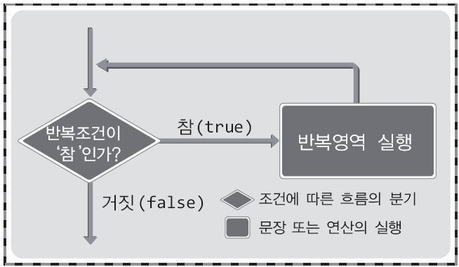

# **Chapter 07 반복실행을 명령하는 반복문**

**반복문의 종류**  
while문, do~while문, for문

> ## 07-1 while문에 의한 문장의 반복

<br>

**while문 이해하기**
```c
#include <stdio.h>
int main(void)
{
    int num = 0;
    
    while(num<3)
    {
        printf("Hello world! %d \n", num);    // 반복문 안에서도 들여쓰기 함
        num++;    // 이 행이 없으면 무한루프가 만들어짐
    }
    
    return 0;
}
```
```
[실행결과]
Hello world! 0
Hello world! 1
Hello world! 2
```
* `while(num < 3)`  
\- num<3는 반복 조건  
\- 조건에 맞으면 반복영역(중괄호 내부)을 실행하고 다시 조건검사를 위한 위치로 이동
* `num++`  
: num이 0부터 시작해서 하나씩 증가 (반복 조건에 의해 num이 3이 되면 while문을 벗어남)
* 즉, (num=0) → (실행, num=1) → (실행, num=2) → (실행, num=3) → (조건(num<3)에 맞지 않으므로 반복문 탈출)



* 반복 대상이 하나의 문장이면 중괄호 생략 가능 (추천하지는 않음)  
    
    ```c
    while(num<3)
        printf("Hello world! %d \n", num++);
    ```
    
    또는  
    
    ```c
    while(num<3)
        printf("Hello world! %d \n", num), num++;
    ```
    
<br>

**무한루프의 구성**

```c
while(1)
{
    printf("%d * %d = %d \n", dan, num, dan*num);
    num++;
}
```

* 숫자 1은 '참'을 의미하는 대표적인 값
* `while(1)`  
: '참'을 의미하는 1이 반복의 조건이 되면 항상 참이 되어 빠져나가지 못하는 반복문이 구성됨  
&nbsp; (break문을 이용하면 빠져나갈 수 있음)

<br>

**while문의 중첩**

```c
#include <stdio.h>
int main(void)
{
    int dan = 2;
    int i = 0
    
    while(dan < 10)    // 2단부터 9단까지 반복
    {
        i = 1;    // 새로운 단의 시작을 위해서
        
        while (i < 10)    // 각 단의 1부터 9의 곱을 표현
        {
            printf("%d * %d = %d \n", dan, i, dan*i);
            i++;
        }
        
        dan++;    // 다음 단으로 넘어가기 위한 증가
    }
    
    return 0;
}
```
<br>

> ## 문제 07-1 \[while문의 활용\]

문제1

```c
#include <stdio.h>
int main(void)
{
    int num;
    int i = 0;
    
    printf("몇 번 반복할까요? ");
    scanf("%d", &num);
    
    while(i < num)
    {
        printf("Hello world! \n");
        i++;
    }
    
    return 0;
}
```

문제2

```c
#include <stdio.h>
int main(void)
{
    int num;
    int i = 1;
    
    printf("양의 정수 하나 입력: ");
    scanf("%d", &num);
    
    while(i<=num)
    {
        printf("%d ", 3*i);
        i++;
    }
    
    return 0;
}
```

```c
/* i = 0으로 초기화한 후 반복문을 다음과 같이 작성해도 됨 */
while(i++<num)    // 비교연산 이후에 i값이 증가함
    printf("%d", 3*i);
/* 또는 */
while (i<num)
{
    i++;
    printf("%d", 3*i);
}
```

문제3

```c
#include <stdio.h>
int main(void)
{
    int num = 1;    // 0이 아닌 수로만 초기화하면 됨
    int result = 0;
    
    while(num != 0)
    {
        printf("정수 입력: ");
        scanf("%d", &num);
        result += num;
    }
    
    printf("입력된 모든 정수의 합: %d \n", result);
    
    return 0;
}
```

문제4

```c
#include <stdio.h>
int main(void)
{
    int num = 0;
    int i = 9;
    
    printf("몇 단 출력? ");
    scanf("%d", &num);
    
    while(i > 0)
    {
        printf("%d * %d = %d \n", num, i, num*i);
        i--;
    }
    
    return 0;
}
```

문제5

```c
#include <stdio.h>
int main(void)
{
    int num, input;
    int i = 0, total = 0;
    
    printf("입력할 정수의 개수: ");
    scanf("%d", &num);
    
    while(i < num)
    {
        printf("정수 입력: ");
        scanf("%d", &input);
        total += input;
        i++;
    }
    
    printf("평균: %f \n", (double)total/num);    // 실수값 얻기 위해 형 변환
    
    return 0;
}
```

<br>

> ## 문제 07-2 \[while문의 중첩\]

문제1

```c
#include <stdio.h>
int main(void)
{
    int num = 0, i = 0, result = 0;
    
    while(i < 5)
    {
        while(num<1)
        {
            printf("%d 번째 1이상의 정수 입력: ", i+1);
            scanf("%d", &num);
        }
        
        result += num;
        num = 0;
        i++;
    }
    
    printf("결과: %d", result);
    
    return 0;
}
```

문제2

```c
#include <stdio.h>
int main(void)
{
    int n = 0, i = 0;
    
    while(n < 5)
    {
        while(i < n)
        {
            printf("ㅇ");
            i++;
        }
        
        i = 0;
        printf("* \n");
        n++;
    }
    
    return 0;
}
```

<br>

> ## 07-2 do~while문에 의한 문장의 반복

<br>

**do~while문의 기본 구성**

```c
/* num = 0으로 초기화되었다고 가정 */
do
{
    printf("Hello world! \n");
    num++;
} while(num<3);
```

* do~while문은 while문과 달리 반복조건을 뒷부분에서 검사
* 따라서 **반복영역을 최소한 한번은 실행**하는 구조  
(while문은 처음부터 반복조건을 만족하지 못하면 반복영역을 한 번도 실행하지 않음)

<br>

**do~while문이 자연스러운 상황**

* 반복영역이 무조건 한 번 이상 실행되어야 함을 강조하고자 하는 경우

<br>

> ## 문제 07-3 \[while문과 do~while문에 익숙해지기\]

문제1

```c
/* 방법1 */
#include <stdio.h>
int main(void)
{
    int total = 0, num = 1;
    
    while(num != 0)
    {
        printf("정수 입력(0 to quit): ");
        scanf("%d", &num);
        total += num;
    }
    
    printf("합계: %d \n", total);
    
    return 0;
}
```

```c
/* 방법2 */
#include <stdio.h>
int main(void)
{
    int total = 0, num = 0;
    
    printf("정수 입력(0 to quit): ");
    scanf("%d", &num);
    total += num;
    
    while(num != 0)
    {
        printf("정수 입력(0 to quit): ");
        scanf("%d", &num);
        total += num;
    }
    
    printf("합계: %d \n", total);
    
    return 0;
}
```

문제2

```c
#include <stdio.h>
int main(void)
{
    int num = 0, result = 0;
    
    do
    {
        result += num;
        num += 2;
    }while(num <= 100);
    
    printf("결과: %d \n", result);
    
    return 0;
}
```

문제3

```c
#include <stdio.h>
int main(void)
{
    int cur=2, is = 0;
    
    do
    {
        is = 1;
        
        do
        {
            printf("%d * %d = %d \n", cur, is, cur*is);
            is++;
        }while(is < 10);
        
        cur++;
    }while(cur < 10);
    
    return 0;
}
```

<br>

> ## 07-3 for문에 의한 문장의 반복

<br>

**반복문의 필수 3요소 (while문 예시)**

```c
int main(void)
{
    int num = 0;    // 필수요소 1. 반복을 위한 변수의 선언
    while(num<3)    // 필수요소 2. 반복의 조건 검사
    {
        printf("Hi~ \n");
        num++;      // 필수요소 3. 반복의 조건을 '거짓'으로 만들기 위한 연산
    }
    ····
}
```

-   필수요소 1 &nbsp; &nbsp; &nbsp; &nbsp; **초기식** &nbsp; &nbsp; &nbsp; &nbsp; 반복을 위한 변수의 선언 및 초기화에 사용
-   필수요소 2 &nbsp; &nbsp; &nbsp; &nbsp; **조건식** &nbsp; &nbsp; &nbsp; &nbsp; 반복의 조건을 검사하는 목적으로 선언됨
-   필수요소 3 &nbsp; &nbsp; &nbsp; &nbsp; **증감식** &nbsp; &nbsp; &nbsp; &nbsp; 반복의 조건을 '거짓'으로 만드는 증가 및 감소연산

<br>

**for문의 구조와 이해**

```c
for(초기식 ; 조건식 ; 증감식)
{
    // 반복의 대상이 되는 문장들
}
```

* for문을 사용하면 반복문에 필요한 세 가지 요소를 한 줄에 표시 가능 (while문은 여러 행에 걸쳐 표시)  
(∴ 반복의 횟수 바로 인식 가능)

위의 while문을 사용한 예제는 다음과 같이 변경 가능

```c
int main(void)
{
    int num;    // 일부 컴파일러는 초기식 위치에서의 변수선언을 허용하지 않기 때문에 변수 미리 선언
    for(num=0; num<3; num++)
        printf("Hi~ \n");    // 반복의 대상이 한 줄이므로 중괄호 생략 가능
    ····
}
```

* for문의 실행방식은 구조적으로 while문의 실행방식과 동일  
\- 초기식: 본격적으로 반복을 시작하기에 앞서 딱 한 번 실행  
\- 조건식: 매 반복의 시작에 앞서 실행되며, 그 결과를 기반으로 반복 유무를 결정  
\- 증감식: 매 반복실행 후 마지막에 연산이 이뤄짐
* 반복의 횟수가 딱 정해진 경우라면 for문이 최선일 수 있지만 경우에 따라 while문이 더 자연스려울 수 있음

<br>

**for문 기반의 다양한 예제**

```c
#include <stdio.h>
int main(void)
{
    int total = 0;
    int i, num;
    
    printf("0부터 어디까지 더할까요? ");
    scanf("%d", &num);
    
    for(i = 0; i <= num; i++)
        total += i;
        
    printf("0부터 %d까지 더한 결과: %d \n", num, total);
    
    return 0;
}
```

```c
#include <stdio.h>
int main(void)
{
    double total = 0.0;
    double input = 0.0;
    int num = 0;
    
    for( ; input >= 0.0 ; )
    {
        total += input;
        printf("실수 입력(minus to quit): ");
        scanf("%lf", &input);
        num++;
    }
    
    printf("평균: %f \n", total(num-1));
    
    return 0;
}
```

* 위 예제처럼 불필요하다면 for문의 초기식, 조건식, 증감식 생략 가능  
(만약 **조건식을 생략하면** 무조건 '참'으로 인식되어 **무한루프** 형성)

<br>

**for문의 중첩**

```c
#include <stdio.h>
int main(void)
{
    int cur, is;
    
    for(cur=2 ; cur <10 ; cur++)
    {
        for(is=1 ; is < 10; is++)
            printf("%d * %d = %d \n", cur, is, cur*is);
    }
    
    return 0;
}
```

<br>

> ## 문제 07-4 \[for문의 활용\]

문제1

```c
#include <stdio.h>
int main(void)
{
    int start, end;
    int result = 0;
    
    printf("정수 2개 입력: ");
    scanf("%d %d", &start, &end);
    
    for( ; start <= end ; start++)
        result += start;
    
    printf("결과: %d \n", result);
    
    return 0;
}
```

문제2

```c
#include <stdio.h>
int main(void)
{
    int n, i;
    int result = 1;
    
    printf("몇 팩토리얼을 구할까요? ");
    scanf("%d", &n);
    
    for(i=1 ; i <= n ; i++)
        result *= i;
    
    printf("&d! = %d \n", n, result);
    
    return 0;
}
```

<br>
<br>
<br>
<br>
<br>
출처: 윤성우의 열혈 C 프로그래밍
