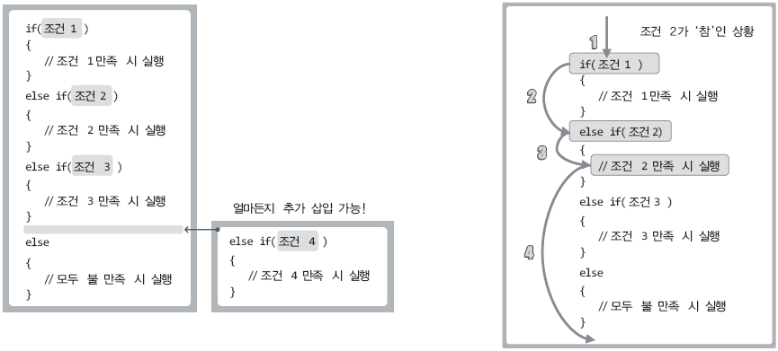
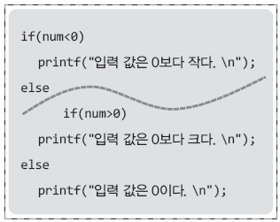
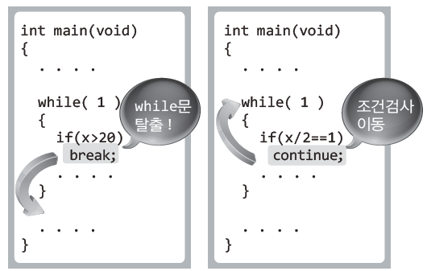
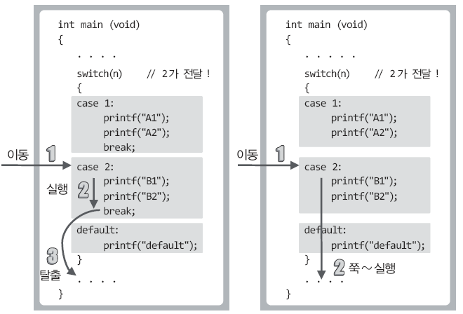
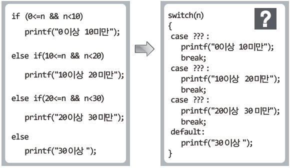

# **Chapter 08 조건에 따른 흐름의 분기**

> ## 08-1 조건적 실행과 흐름의 분기

<br>

**흐름의 분기가 필요한 이유**  
: 선택적으로 실행하기 위해

<br>

**if문을 이용한 조건적 실행**

```c
if(num1>num2)
{
    printf("num1이 num2보다 큽니다. \n");
    printf("%d > %d \n", num1, num2);
}
```

```c
/* 1이상 100미만인 정수 중에서 3의 배수이거나 4의 배수인 정수 출력 */
#include <stdio.h>
int main(void)
{
    int num;
    
    for(num=1 ; num<100 ; num++)
        if(num%3==0 || num%4==0)
            printf("3 또는 4의 배수: %d \n", num);
    
    return 0;
}
```

* `if(num1>num2)`  
num1이 num2보다 크면 아래 중괄호 실행
* 실행문이 한 줄이면 중괄호 생략 가능
* `if(num%3==0 || num%4==0)`  
|| 연산자보다 관계연산자인 ==연산자의 우선순위가 높기 때문에 <br> 두 개의 ==연산의 결과를 대상으로 || 연산 진행
* **if문**은 몇 줄에 걸쳐서 표현되건 **하나의 문장**으로 인식  
(∴ 위 예제에서 for문에 속하는 중괄호 생략됨)

<br>

**예제1 계산기 프로그램 (if문 활용)**

```c
#include <stdio.h>
int main(void)
{
    int opt;
    double num1, num2;
    double result;
    
    printf("1.덧셈 2.뺄셈 3.곱셈 4.나눗셈 \n");
    printf("선택? ");
    scanf("%d", &opt);
    printf("두 개의 실수 입력: ");
    scanf("%lf %lf", &num1, &num2);
    
    if(opt==1)
        result = num1 + num2;
    if(opt==2)
        result = num1 - num2;
    if(opt==3)
        result = num1 * num2;
    if(opt==4)
        result = num1 / num2;
    
    printf("결과: %f \n", result);
    
    return 0;
}
```

* 문제점: 어떤 숫자가 입력되든 조건검사(비교연산) 4개 모두 실행됨  
&nbsp; &nbsp; &nbsp; &nbsp; &nbsp; &nbsp; → 불필요한 연산이 생기기 때문에 비효율적!  
&nbsp; &nbsp; &nbsp; &nbsp; &nbsp; &nbsp; → **if~else문** 사용

<br>

**if~else문을 이용한 흐름의 분기**

```c
if(num<0)    // num<0이 '참'이면 아래의 if블록 실행
    printf("입력 값은 0보다 작다. \n");
else         // num<0이 '거짓'이면 아래의 else블록 실행
    printf("입력 값은 0보다 작지 않다. \n");
```

* 두 개의 블록 중 하나를 선택해서 실행하는 구조
* if절의 조건이 '참'이면 if블록이 실행되고, 조건이 '거짓'이면 else블록이 실행되는 구조
* 참고로 키워드 else는 독립적으로 사용되는 것이 아니라 키워드 if와 더불어 하나의 문장을 구성하는 형태로 사용  
(if와 else가 만나서 이루는 문장의 수는 둘이 아니라 하나다!)
* if~else문은 하나의 문장이므로 사이에 다른 문장이 삽입될 수 없음

<br>

**if...else if...else의 구성**


* 셋 이상의 블록 중 하나를 선택해서 실행하는 구조
* 얼마든지 else if절 추가 삽입 가능
* 조건의 만족여부 검사는 위에서 아래로 진행됨
* 한 번이라도 조건이 만족되어 해당 블록을 실행하고 나면 마지막에 있는 else까지도 그냥 건너뜀

<br>

**예제2 계산기 프로그램 (if...else if...else문 활용)**

```c
#include <stdio.h>
int main(void)
{
    int opt;
    double num1, num2;
    double result;
    
    printf("1.덧셈 2.뺄셈 3.곱셈 4.나눗셈 \n");
    printf("선택? ");
    scanf("%d", &opt);
    printf("두 개의 실수 입력: ");
    scanf("%lf %lf", &num1, &num2);
    
    if(opt==1)
        result = num1 + num2;
    else if(opt==2)
        result = num1 - num2;
    else if(opt==3)
        result = num1 * num2;
    else
        result = num1 / num2;
    
    printf("결과: %f \n", result);
    
    return 0;
}
```

* if로만 구성된 예제1보다 연산의 수가 훨씬 줄어듦

<br>

**if...else if...else의 진실**

| <br> &nbsp; if (num<0) <br> &nbsp; &nbsp; &nbsp; &nbsp; &nbsp; printf("입력 값은 0보다 작다. \\n"); &nbsp; &nbsp; &nbsp; &nbsp; &nbsp; &nbsp; &nbsp; &nbsp; <br> &nbsp; else if (num>0) <br> &nbsp; &nbsp; &nbsp; &nbsp; &nbsp; printf("입력 값은 0보다 크다. \\n"); &nbsp; &nbsp; &nbsp; &nbsp; &nbsp; &nbsp; &nbsp; &nbsp; <br> &nbsp; else <br> &nbsp; &nbsp; &nbsp; &nbsp; &nbsp; printf("입력 값은 0이다. \\n"); &nbsp; &nbsp; &nbsp; &nbsp; &nbsp; &nbsp; &nbsp; &nbsp; <br> <br> <br> <br> <br> <br> <br> | <br> &nbsp; if (num<0) <br> &nbsp; { <br> &nbsp; &nbsp; &nbsp; &nbsp; &nbsp; printf("입력 값은 0보다 작다. \\n"); <br> &nbsp; } <br> &nbsp; else <br> &nbsp; { <br> &nbsp; &nbsp; &nbsp; &nbsp; &nbsp; if (num>0) <br> &nbsp; &nbsp; &nbsp; &nbsp; &nbsp; &nbsp; &nbsp; &nbsp; &nbsp; printf("입력 값은 0보다 크다. \\n"); &nbsp; &nbsp; &nbsp; &nbsp; &nbsp; &nbsp; &nbsp; &nbsp; <br> &nbsp; &nbsp; &nbsp; &nbsp; &nbsp; else <br> &nbsp; &nbsp; &nbsp; &nbsp; &nbsp; &nbsp; &nbsp; &nbsp; &nbsp; printf("입력 값은 0이다. \\n"); <br> &nbsp; } <br> <br> |
| :--- | :--- |

* 위 두 코드는 같은 코드
* if...else if...else는 if~else문을 중첩시킨 형태  
(else블록을 대상으로 중첩)

    

<br>

**조건 연산자: 피 연산자가 세 개인 '삼 항 연산자'**

* **조건 연산자**  
`(조건) ? data1 : data2`  
: 조건이 '참'이면 data1 반환, '거짓'이면 data2 반환

```c
#include <stdio.h>
int main(void)
{
    int num, abs;
    printf("정수 입력: ");
    scanf("%d", &num);
    
    abs = num>0 ? num : num*(-1);
    printf("절댓값: %d \n", abs);
    
    return 0;
}
```
```
[실행결과]  
정수 입력: -79  
절댓값: 79
```

* `abs = num>0 ? num : num\*(-1);`  
: 대입 연산자보다 조건 연산자의 우선순위가 높으므로 조건 연산자가 먼저 진행됨  
&nbsp; (반환된 값을 abs에 대입)
* 반환해야 할 값을 명시할 위치에 num\*(-1)과 같은 연산식이 올 수 있고 연산식의 계산결과가 반환됨

<br>

> ## 문제 08-1 \[if~else문의 활용\]

문제1

```c
#include <stdio.h>
int main(void)
{
    int num;
    for(num=1 ; num<100 ; num++)
        if(num%7==0 || num%9==0)
            printf("%d \n", num);
    
    return 0;
}
```

문제2

```c
#include <stdio.h>
int main(void)
{
    int num1, num2;
    printf("정수 2개 입력: ");
    scanf("%d %d", &num1, &num2);
    
    if (num1 >num2)
        printf("결과: %d \n", num1-num2);
    else
        printf("결과: %d \n", num2-num1);
    
    return 0;
}
```

문제3

```c
#include <stdio.h>
int main(void)
{
    int korean, english, math;
    double average;
    char score;
    
    printf("국어, 영어, 수학 점수 입력: ");
    scanf("%d %d %d", &korean, &english, &math);
    
    average = (korean + english + math) / 3.0;
    
    if (average >= 90.0)
        score = 'A';
    else if (average >= 80.0)
        score = 'B';
    else if (average >= 70.0)
        score = 'C';
    else if (average >= 50.0)
        score = 'D';
    else
        score = 'F';
    
    printf("평균: %f \n", average);
    printf("학점: %c \n", score);
    
    return 0;
}
```

문제4

```c
#include <stdio.h>
int main(void)
{
    int num1, num2, result;
    printf("정수 2개 입력: ");
    scanf("%d %d", &num1, &num2);
    
    result = (num1>num2) ? (num1-num2) : (num2-num1);
    
    printf("결과: %d \n", result);
    
    return 0;
}
```

<br>

> ## 08-2 반복문의 생략과 탈출: break & continue

<br>



<br>

**break! 이제 그만 빠져나가자!**

```c
#include <stdio.h>
int main(void)
{
    int sum=0, num=0;
    
    while(1)
    {
        sum += num;
        if(sum>5000)
            break;    // break문 실행! 따라서 반복문 탈출
        num++;
    }
    
    printf("sum: %d \n", sum);
    printf("num: %d \n", num);
    
    return 0;
}
```
```
[실행결과]  
sum: 5050  
num: 100
```

* `break;`  
: break문을 가장 가까이서 감싸고 있는 반복문 하나 탈출
* break문이 if문과 함께 쓰였다고 해서 if문을 빠져나오는 것으로 오해하면 안 됨  
(**break문은 반복문 탈출에 사용**)

<br>

**continue! 나머지 생략하고 반복조건 확인하러 가자!**

```c
#include <stdio.h>
int main(void)
{
    int num;
    printf("start! ");
    
    for(num=1 ; num<20 ; num++)
    {
        if(num%2==0 || num%3==0)
            continue;
        printf("%d ", num);
    }
    
    printf("end! \n");
    
    return 0;
}
```
```
[실행결과]  
start! 1 5 7 11 13 17 19 end!
```

* `continue;`  
: 실행중인 위치에 상관없이 반복문의 조건검사 위치로 이동해서 반복조건이 여전히 '참'이면 반복영역 다시 실행  
: continue문의 이후는 생략하고 다시 실행
* if문이 만족해서 continue 실행되면 그 다음 행에 있는 printf는 실행되지 않고 조건검사를 위해 for문으로 이동  
(num=6인 경우 continue문을 실행하게 되는데, 이때 printf를 건너 뛰고 num=7이 된 상태에서 for문 실행)
* continue문은 반복문을 빠져나가지 않음 (break문은 반복문을 빠져나감)

<br>

> ## 문제 08-2 \[break & continue의 활용\]

문제1

```c
#include <stdio.h>
int main(void)
{
    int dan, i;
    
    for(dan=2 ; dan<=9 ; dan++)
    {
        if(dan%2 != 0)
            continue;
            
        for(i=1 ; i<=9 ; i++)
        {
            if (i > dan)
                break;
            printf("%d * %d = %d \n", dan, i, dan*i);
        }
    }
    
    return 0;
}
```

문제2

```c
#include <stdio.h>
int main(void)
{
    int A, Z;
    
    for(A=0 ; A<10 ; A++)
    {
        for(Z=0 ; Z<10 ; Z++)
        {
            if ((10*A + Z + 10*Z + A) != 99)
                continue;
                
            printf("A = %d, Z= %d \n", A, Z);
        }
    }
    
    return 0;
}
```

<br>

> ## 08-3 switch문에 의한 선택적 실행과 goto문

<br>

**switch문의 구성과 기본기능**

switch문은 if...else if...else와 유사한 측면이 있어 대체해서 사용하기도 하지만 사용할 수 있는 영역은 제한적

```c
#include <stdio.h>
int main(void)
{
    int num;
    printf("1이상 3이하의 정수 입력: ");
    scanf("%d", &num);
    
    switch(num)
    {
        case 1:
            printf("1은 ONE \n");
            break;
        case 2:
            printf("2는 TWO \n");
            break;
        case 3:
            printf("3은 THREE \n");
            break;
        default:
            printf("I don't know! \n");
    }
    
    return 0;
}
```
```
[실행결과1]  
1이상 3이하의 정수 입력: 2  
2는 TWO
```
```
[실행결과2  
1이상 3이하의 정수 입력: 5  
I don't know!
```

* `switch(num)`  
\- num은 switch문으로 전달되는 인자의 정보  
\- num은 정수형 변수여야 함(char형도 포함)  
\- num에 저장된 값에 따라 실행할 영역이 결정됨  
&nbsp; (num에 저장된 값이 1이면 case 1의 영역을, num에 저장된 값이 3이면 case 3의 영역을 실행  
\- switch문의 인자로 연산이 올 수 있음 (예를 들어 `switch(num/2)`도 가능하며, 연산의 결과가 인자가 됨)  
&nbsp; (문제 08-3 참고)
* `case 1:`  
: num을 통해 전달된 정수의 값이 1인 경우
* `case 2:`  
: num을 통해 전달된 정수의 값이 2인 경우
* `case 3:`  
: num을 통해 전달된 정수의 값이 3인 경우
* **case 레이블**  
\- case문은 위치를 표시하는 데 사용되므로 '**레이블(label)**'이라 함  
\- case 레이블의 상수 값을 1부터 시작하지 않아도 됨  
\- 레이블의 끝에는 세미콜론(;)이 아닌 **콜론(:)**을 붙여야 함
* `default:`  
: if...else if...else의 else와 유사 (일치하는 case 레이블이 없을 경우에 실행되는 영역 표시에 사용)  
&nbsp; (불필요하면 생략 가능)
* `break;`  
: switch문 탈출 용도로 쓰임 (switch문이 영역별로 구분되어 해당 영역만 실행되도록 돕는 역할)  
&nbsp; (break문이 없다면 해당 영역 실행 후 그 이하를 모두 실행해버림)
    

<br>

**break문을 생략한 형태의 switch문 구성**

```c
#include <stdio.h>
int main(void)
{
    char sel;
    printf("M 오전, A 오후, E 저녁 \n");
    printf("입력: ");
    scanf("%c", &sel);
    
    switch(sel)
    {
        case 'M':
        case 'm':
            printf("Morning \n");
            break;
        case 'A':
        case 'a':
            printf("Afternoon \n");
            break;
        case 'E':
        case 'e':
            printf("Evening \n");
            break;    // 사실 불필요한 break문
    }
    
    return 0;
}
```

* `case 'M':`  
`case 'm':`  
\- 두 case 레이블을 한 줄에 같이 표시하기도 함 (`case 'M': case 'm':` 으로 표시하기도 함)  
\- 두 개의 case 레이블이 묶여있기 때문에 M이 입력되건, m이 입력되건 동일한 문자열 출력
* switch문에서 break문은 선택적으로 입력해야 함  
(∵ break문이 삽입되어 유용한 경우도 있지만, break문이 삽입되지 않아서 유용한 경우도 있음)

<br>

**switch &nbsp; vs &nbsp; if...else if...else**

* switch문으로 구현된 모든 옞는 if...else if...else를 통해서도 구현할 수 있음
* 분기의 경우 수가 많아지면 가급적 switch문으로 구현하는 것이 좋음
* switch문으로 표현하기 애매한 상황에서는 if...else if...else 사용  
(분기의 수가 많다고 switch문만 고집할 필요는 없음)

  
&nbsp; &nbsp; &nbsp; &nbsp; &nbsp; &nbsp; &nbsp; &nbsp; &nbsp; &nbsp; &nbsp; &nbsp; &nbsp; &nbsp; &nbsp; &nbsp; &nbsp; &nbsp; &nbsp; &nbsp; &nbsp; &nbsp; &nbsp; &nbsp; &nbsp; &nbsp; <sup>switch문으로 구현하기 애매한 상황</sup>

<br>

**goto**

* 프로그램의 흐름을 원하는 위치로 이동시킬 때 사용
* 프로그램의 자연스러운 흐름을 방해하기 때문에 goto문 사용은 가급적 자제

```c
#include <stdio.h>
int main(void)
{
	int num;
	printf("자연수 입력: ");
	scanf("%d", &num);

	if (num == 1)
		goto ONE;        // 레이블 ONE의 위치로 이동!
	else if (num == 2)
		goto TWO;        // 레이블 TWO의 위치로 이동!
	else
		goto OTHER;      // 레이블 OTHER의 위치로 이동!

ONE:            // 위치지정에 사용된 ONE이라는 이름의 레이블
	printf("1을 입력하셨습니다! \n");
	goto END;            // 레이블 END의 위치로 이동!
TWO:            // 위치지정에 사용된 TWO라는 이름의 레이블
	printf("2를 입력하셨습니다! \n");
	goto END;            // 레이블 END의 위치로 이동!
OTHER:          // 위치지정에 사용된 OTHER이라는 이름의 레이블
	printf("3 혹은 다른 값을 입력하셨군요! \n");

END:            // 위치지정에 사용된 END라는 이름의 레이블
	return 0;
}
```

* 레이블은 실행의 대상이 아닌, 위치를 표시하는 역할로 사용되는 표식이기 때문에 편집기상에서 왼쪽 정렬 됨

<br>

> ## 문제 08-3 \[switch문으로 대신하기\]

```c
#include <stdio.h>
int main(void)
{
    int n;
    printf("0이상의 정수 입력: ");
    scanf("%d", &n);
    
    switch(n/10)
    {
        case 0:
            printf("0이상 10미만 \n");
            break;
        case 1:
            printf("10이상 20미만 \n");
            break;
        case 2:
            printf("20이상 30미만 \n");
            break;
        default:
            printf("30이상 \n");
    }
    
    return 0;
}
```

<br>
<br>
<br>
<br>
<br>
출처: 윤성우의 열혈 C 프로그래밍
