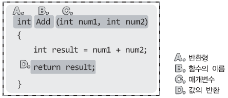
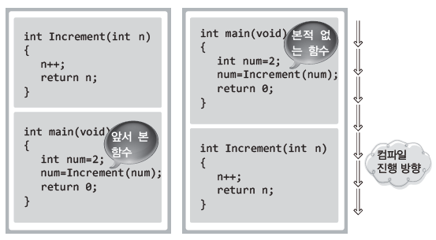
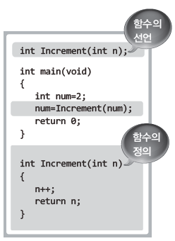
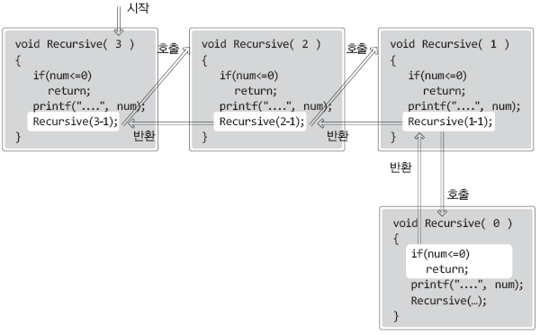

# **Chapter 09 C언어의 핵심! 함수!**

> ## 09-1 함수를 정의하고 선언하기

<br>

**함수를 만드는 이유**

### <center> " Divide and Conquer! " </center>

<br>

\- 함수를 만들면 크고 복잡한 문제를 작게 쪼개서 해결하는 효과를 얻을 수 있음  
\- 소스코드의 변경이 필요한 경우에 변경의 범위를 축소 및 제한할 수 있음

<br>

**함수의 입력과 출력: printf 함수도 반환을 합니다**

```c
#include <stdio.h>
int main(void)
{
    int num1, num2, num3;
    num1 = printf("12345 \n");
    num2 = printf("I love my home \n");
    num3 = printf("안녕하세요\n");
    printf("%d %d %d \n", num1, num2, num3);
    
    return 0;
}
```
```
[실행결과]
12345
I love my home  
안녕하세요
6 15 11
```
* 5행 ~ 7행에서 printf 함수를 호출했기 때문에 실행결과 첫 번째 ~ 세 번째 줄과 같이 실행됨
* printf 함수는 공백과 \\n 문자를 포함하여 모니터에 출력한 문자열의 길이를 반환
* 따라서 num1과 num2에는 printf의 반환값인 문자열의 길이가 대입됨
* Windows는 한글을 2바이트로 표현하기 때문에 Windows에서의 printf 함수는 한글 하나당 그 길이를 2로 계산  
    (운영체제에 따라 달라짐)

<br>

**함수의 구분**  
\- 유형 1: 전달인자(○), 반환 값(○)  
\- 유형 2: 전달인자(○), 반환 값(X)  
\- 유형 3: 전달인자(X), 반환 값(○)  
\- 유형 4: 전달인자(X), 반환 값(X)

<br>

**다양한 형태의 함수 정의 1: 전달인자와 반환 값이 모두 있는 경우**



\- 전달인자는 int형 정수 둘이며, 이 둘을 이용한 덧셈을 진행한다.  
\- 덧셈의 결과는 반환이 되며, 따라서 반환형도 int형으로 선언한다.  
\- 마지막으로 함수의 이름은 Add라 하자!

* **C. 매개변수의 선언**  
: 함수호출 시 전달되는 인자를 저장할 변수의 선언
* **D. 값의 반환**  
: num1과 num2의 값을 더해 변수 result에 저장하고, result에 저장된 값을 반환함
* **A. 반환형**  
: 반환되는 result의 값이 int형이므로 반환형은 int
* 함수호출 시 전달할 수 있는 인자의 수는 여러 개가 될 수 있지만 반환할 수 있는 값의 수는 하나

```c
#include <stdio.h>
int Add(int num1, int num2)
{
    return num1+num2;
}

int main(void)
{
    int result;
    result = Add(3, 4);
    printf("덧셈 결과1: %d \n", result);
    result = Add(5, 8);
    printf("덧셈 결과2: %d \n", result);
    
    return 0;
}
```

* `return num1+num2;`  
: 매개변수를 대상으로 직접 덧셈연산을 하여 그 결과를 바로 반환
* `result = Add(3, 4);`  
: Add함수를 호출하여 반환된 값을 result에 저장 (함수의 호출문이 반환 값으로 대체됨)  
&nbsp; (result = 7; 과 같이 대입연산만 남은 형태)
* 한 번 정의된 함수는 몇 번이고 반복 호출할 수 있음

<br>

**다양한 형태의 함수 정의2: 전달인자나 반환 값이 존재하지 않는 경우**

```c
void ShowAddResult(int num)    // 인자전달 (○), 반환 값(X)
{
    printf("덧셈 결과 출력: %d \n", num);
}
```

* 서식지정을 매번 하지 않아도 되도록 정의한 함수
* `void`  
: 위에서 void는 '반환하지 않는다'라는 뜻으로 사용됨 (∴ return문 없음)

```c
int ReadNum(void)    // 인자전달(X), 반환 값(○)
{
    int num;
    scanf("%d", &num);
    return num;
}
```

* scanf 함수보다 호출하기 편리하도록 정의한 함수
* `void`  
: 위에서 void는 '인자를 전달하지 않는다'라는 뜻으로 사용됨  
&nbsp; (∴ 함수를 호출할 때 인자를 전달하면 안 됨)

```c
void HowToUseThisProg(void)    // 인자전달(X), 반환 값(X)
{
    printf("두 개의 정수를 입력하시면 덧셈 결과가 출력됩니다. \n");
    printf("자! 그럼 두 개의 정수를 입력하세요. \n");
}
```

* 프로그램의 사용 방법을 소개하도록 정의한 함수
* 인자의 전달도 값의 반환도 불필요하기 때문에 매개변수와 반환형 모두 void로 선언

<br> 

예제

```c
#include <stdio.h>
int Add(int num1, int num2)
{
    return num1+num2;
}

void ShowAddResult(int num)
{
    printf("덧셈 결과 출력: %d \n", num);
}

int ReadNum(void)
{
    int num;
    scanf("d", &num);
    return num;
}

void HowToUseThisProg(void)
{
    printf("두 개의 정수를 입력하시면 덧셈 결과가 출력됩니다. \n");
    printf("자! 그럼 두 개의 정수를 입력하세요. \n");
}

int main(void)
{
    int result, num1, num2;
    HowToUseThisProg();
    num1 = ReadNum();
    num2 = ReadNum();
    result = Add(num1, num2);
    ShowAddResult(result);
    
    return 0;
}
```
```
[실행결과]
두 개의 정수를 입력하시면 덧셈 결과가 출력됩니다.  
자! 그럼 두 개의 정수를 입력하세요.  
12 24  
덧셈 결과 출력: 36
```

<br>

**값을 반환하지 않는 return**

```c
void NoReturnType(int num)
{
    if(num<0)
        return;    // 값을 반환하지 않는 return문!
    ····
}
```

* **return문의 의미**  
\- 함수를 빠져나간다!  
\- 값을 반환한다.
* `return;`  
: 반환할 값이 명시되어 있지 않음  
&nbsp; (값은 반환하지 않되 함수를 빠져나가는 용도로 사용)

<br>

**함수의 정의와 그에 따른 원형의 선언**



\- 왼쪽의 경우는 'Increment 함수의 정의'가 'Increment 함수의 호출문'보다 먼저 등장하기 때문에 컴파일 가능  
\- 오른쪽의 경우는 'Increment 함수의 정의'에 앞서 'Increment 함수의 호출문'이 먼저 등장했기 때문에 에러 발생

해결방법: Increment 함수가 뒤에 나온다고 알려주기 (함수의 선언을 먼저 하기)



참고) 함수의 선언에는 매개변수의 갯수 및 자료형 정보만 포함되면 되기 때문에 매개변수의 이름을 생략해서 선언 가능  
&nbsp; &nbsp; &nbsp; &nbsp; &nbsp; ex) `int Example(int, int)`

<br>

**다양한 종류의 함수 정의하기**

```c
#include <stdio.h>
int AbsoCompare(int num1, int num2);    // 절댓값이 큰 정수 반환
int GetAbsoValue(int num);              // 전달인자의 절댓값을 반환

int main(void)
{
	int num1, num2;
	printf("두 개의 정수 입력: ");
	scanf_s("%d %d", &num1, &num2);
	printf("%d와 %d 중 절댓값이 큰 정수: %d \n", num1, num2, AbsoCompare(num1, num2));

	return 0;
}

int AbsoCompare(int num1, int num2)
{
	if (GetAbsoValue(num1) > GetAbsoValue(num2))
		return num1;
	else
		return num2;
}

int GetAbsoValue(int num)
{
	if (num < 0)
		return num * (-1);
	else
		return num;
}
```

* **AbsoCompare 함수와 GetAbsoValue 함수**  
: 하나의 함수 내에 둘 이상의 return문이 존재하는 경우도 있음  
&nbsp; (if 조건을 만족하느냐 못하느냐에 따라 반환 값이 다름)
* `printf("%d와 %d 중 절댓값이 큰 정수: %d", num1, num2, AbsoCompare(num1, num2));`  
: 함수의 반환 값이 전달인자가 될 수 있음
* `if (GetAbsoValue(num1) > GetAbsoValue(num2))`  
: 함수의 반환 값을 대상으로 비교연산 진행
* main을 포함한 모든 함수는 필요에 따라 얼마든지 다른 함수를 호출할 수 있음

<br>

> ## 문제 09-1 \[다양한 함수 정의하기\]

문제1

```c
#include <stdio.h>
int BigNumber(int num1, int num2, int num3)
{
    if (num1>num2 | num1>num3)
        return num1;
    if else (num2>num1 | num2>num3)
        return num2;
    else
        return num3;
}

int SmallNumber(int num1, int num2, int num3)
{
    if (num1 < num2)
        return (num1 < num3) ? num1 : num3;
    else
        return (num2 < num3) ? num2 : num3;
}

int main(void)
{
    printf("정수 3개 입력: ");
    scanf("%d %d %d", &num1, &num2, &num3);
    printf("가장 큰 수: %d \n", BigNumber(num1, num2, num3));
    printf("가장 작은 수: %d \n", SmallNumber(num1, num2, num3));
    
    return 0;
}
```

* 함수 SmallNumber처럼 return문을 조건 연산자와 작성할 수 있으며 BigNumber 함수보다 간결함

문제2

```c
#include <stdio.h>
double CelToFah(double Cel)
{
    return 1.8 * Cel + 32;
}

double FahToCel(double Fah)
{
    return (Fah-32)/1.8;
}

int main(void)
{
    int sel;
    int value;
    printf("1. 섭씨 -> 화씨 \n2. 화씨 -> 섭씨 \n");
    printf("선택: ");
    scanf("%d", &sel);
    
    if (sel == 1)
    {
        printf("섭씨 입력: ");
        scanf("%lf", &value);
        printf("화씨: %f \n", CelToFah(value));
    }
    
    else if (sel == 2)
    {
        printf("화씨 입력: ");
        scanf("%lf", &value);
        printf("섭씨: &f \n", FahToCel(value));
    }
    else
        printf("다시 선택하세요 \n"); 
    
    return 0;
}
```

문제3 (피보나치 수열)

```c
#include <stdio.h>
int Fibo(int num1, int num2)
{
    return num1+num2;
}

int main(void)
{
    int repeat, i, c;
    int num1=0, num2=1;
    printf("몇 개의 피보나치 수열을 출력할까요? ");
    scanf("%d", &repeat);
    
    for(i=0 ; i<repeat ; i++)
    {
        if (i==0)
            printf("%d ", num1);
        else if (i==1)
            printf("%d ", num2);
        else
        {
            c = Fibo(num1, num2);
            printf("%d ", c);
            num1 = num2;
            num2 = c;
        }
    }
    
    return 0;
}
```

문제3 (정답)

```c
#include <stdio.h>
void ShowFiboSeries(in num)
{
    int f1=0, f2=1, f3, i;
    if (num==1)
        printf("%d ", f1);
    else
        printf("%d %d", f1, f2);
    
    for(i=0 ; i<num-2 ; i++)
    {
        f3 = f1 + f2;
        printf("%d ", f3);
        f1 = f2;
        f2 = f3;
    }
    
}

int main(void)
{
    int n;
    printf("출력하고자 하는 피보나치 수열의 갯수: ");
    scanf("%d", &n);
    
    if(n<1)
    {
        printf("1 이상의 값을 입력하세요. \n");
        return -1;
    }
    
    ShowFiboSeries(n);
    
    return 0;
}
```

<br>

> ## 09-2 변수의 존재기간과 접근범위 1: 지역변수

* 함수는 **메모리상에 존재하는 기간**과 **변수에 접근할 수 있는 범위**에 따라 **'지역변수'** 와 **'전역변수'** 로 나뉨

<br>

**함수 내에만 존재 및 접근 가능한 지역변수(Local Variable)**

```c
#include <stdio.h>

int SimpleFuncOne(void)
{
    int num = 10;    // 이후부터 SimpleFuncOne의 num 유효
    num++;
    printf("SimpleFuncOne num: %d \n", num);
    return 0;        // SimpleFuncOne의 num이 유효한 마지막 문장
}

int SimpleFuncTwo(void)
{
    int num1 = 20;    // 이후부터 num1 유효
    int num2 = 30;    // 이후부터 num2 유효
    num++, num2--;
    printf("num1 & num2: %d %d \n", num1, num2);
    return 0;         // num1, num2 유효한 마지막 문장
}

int main(void)
{
    int num = 17;    // 이후부터 main의 num 유효
    SimpleFuncOne();
    SimpleFuncTwo();
    printf("main num: %d \n", num);
    return 0;        // main의 num이 유효한 마지막 문장
}
```
```
[실행결과]  
SimpleFuncOne num: 11  
num1 & num2: 21 29  
main num: 17
```

* **지역변수**  
: 함수 내에 선언되는 변수 (지역변수에서 말하는 지역은 함수의 중괄호에 의해 형성되는 영역)
* 지역변수는 선언된 이후로부터 함수 내에서만 접근 가능
* 한 지역(함수) 내에 동일한 이름의 변수 선언 불가능
* 다른 지역(함수)에 동일한 이름의 변수 선언 가능
* 지역변수는 해당 지역(함수)를 빠져나가면 자동으로 소멸됨
* 함수가 호출될 때마다 변수는 새롭게 메모리 공간에 할당됨
* 지역변수는 해당 선언문이 실행될 때 메모리 공간에 할당되었다가,  
선언문이 존재하는 함수가 반환을 하면(종료를 하면) 메모리 공간에서 소멸됨

<br>

**다양한 형태의 지역변수**

```c
#include <stdio.h>
int main(void)
    int cnt;    // main함수 내에서 유효
    for(cnt=0 ; cnt<3 ; cnt++)
    {
        int num = 0;    // for문 내에서만 유효
        num++;
        printf("%d번째 반복, 지역변수 num은 %d \n", cnt+1, num);
    }
    
    if (cnt==3)
    {
        int num = 7;    // if문 내에서만 유효
        num++;
        printf("if문 내에 존재하는 지역변수 num은 %d \n", num);
    }
    
    return 0;
}
```
```
실행결과  
1번째 반복, 지역변수 num은 1  
2번째 반복, 지역변수 num은 1  
3번째 반복, 지역변수 num은 1  
if문 내에 존재하는 지역변수 num은 8
```

* **cnt**  
: main함수의 시작부분에서 선언되었기 때문에 main함수 내에 어디서든 접근 가능  
&nbsp; (for문 내에서도, if문 내에서도 접근 가능)
* **for문의 num**  
\- for문 내에서만 유효  
\- for문에 의한 반복이 중괄호 내에서 이루어지는 것이 아니라 중괄호의 진입과 탈출을 반복하면서 이루어지므로  
&nbsp; 반복이 이루어질 때마다 변수 num은 메모리상에 할당되고 소멸됨
* **if문의 num**  
: if문 내에서만 유효

```c
#include <stdio.h>

int main(void)
{
    int num=1;
    
    if (num==1)
    {
        int num=7;    // 주석처리 한다면 실행결과2
        num+=10;
        printf("if문 내 지역변수 num: %d \n", num);
    }
    
    printf("main 함수 내 지역변수 num: %d \n", num);
    
    return 0;
}
```
```
[실행결과 1] 
if문 내 지역변수 num: 17  
main 함수 내 지역변수 num: 1
```
```
[실행결과 2]  
if문 내 지역변수 num: 11  
main 함수 내 지역변수 num: 11
```

* int num=7을 주석처리하지 않았을 때  
: if문 내에서는 main함수의 num이 가리워짐  
&nbsp; (∴ if문에서 접근하는 num과 main함수에서 접근하는 num은 다름)
* int num=7을 주석처리 했을 때  
: if문 내에서 접근하는 num은 main함수의 num이 됨

<br>

**지역변수의 일종인 매개변수!**

* 매개변수도 선언된 함수 내에서만 접근 가능
* 선언된 함수가 반환을 하면, 지역변수와 마찬가지로 매개변수 소멸

참고) 지역변수를 가리켜 '자동변수(automatic variable)'라고도 함  
&nbsp; &nbsp; &nbsp; &nbsp; &nbsp; &nbsp; &nbsp; &nbsp; &nbsp; (선언된 영역을 벗어나면서 자동으로 소멸되기 때문에 붙여진 이름)

<br>

> ## 09-3 변수의 존재기간과 접근범위 2: 전역변수, static 변수, register 변수

**전역변수의 이해와 선언방법**

```
#include <stdio.h>
void Add(int val);
int num;    // 전역변수는 기본 0으로 초기화됨

int main(void)
{
    printf("num: %d \n", num);
    Add(3);
    printf("num: %d \n", num);
    num++;    // 전역변수 num의 값 1 증가
    printf("num: %d \n", num);
    return 0;
}

void Add(int val)
{
    num += val;    // 전역변수 num의 값 val만큼 증가
}
```

> **실행결과**  
> num: 0  
> num: 3  
> num: 4

-   **전역변수**  
    \- 함수 외부에 선언됨  
    \- 프로그램의 시작과 동시에 메모리 공간에 할당되어 종료 시까지 존재  
    \- 별도의 값으로 초기화하지 않으면 0으로 초기화됨  
    \- 프로그램 전체 영역 어디에서든 접근 가능
-   main함수와 Add 함수 내에서 접근하는 변수 num은 전역변수 num임  
    (∵ 해당 함수에 num이라는 이름의 다른 변수는 선언되어 있지 않음)

**전역변수와 동일한 이름의 지역변수가 선언되면?**

```
#include <stdio.h>
int Add(int val);
int num=1;

int main(void)
{
    int num=5;
    printf("num: %d \n", Add(3));
    printf("num: %d \n", num+9);
    return 0;
}

int Add(int val)
{
    int num=9;
    num += val;
    return num;
}
```
```
[실행결과]  
num: 12  
num: 14
```

* 전역변수와 동일한 이름의 지역변수가 선언되면 해당 지역 내에서는 전역변수가 가리워짐
* `printf("num: %d \\n", Add(3));`  
: Add 함수의 num인 9와 전달인자 3이 합쳐진 12가 출력됨
* `printf("num: %d \\n", num+9);`  
: main 함수의 num인 5와 9가 합쳐진 14가 출력됨

참고) 설명을 위해 전역변수와 동일한 이름의 지역변수를 선언하였지만, 가급적이면 변수의 이름은 달리하는 것이 좋음

<br>

**전역변수! 괜찮은 것 같은데 좀 많이 써도 될까요?**

* 전역변수의 변경은 전체 프로그램의 변경으로 이어질 수 있기 때문에 전역변수의 선언은 신중해야 함
* 전역변수의 수가 증가하면 그만큼 프로그램은 복잡해지며, 좋은 구조의 프로그램과는 거리가 멀어지게 됨

참고) 스파게티 코드(Spaghetti Code) : 전역변수의 과도한 선언과 같은 잘못된 프로그래밍 방식에 의해서 생성된 얽히고 설킨 코드

<br>

**지역변수에 static 선언을 추가해서 만드는 static 변수**

```c
#include <stdio.h>

void SimpleFunc(void)
{
    static int num1=0;    // 초기화하지 않으면 0 초기화 (프로그램이 실행되면 이 함수에 존재하지 않음)
    int num2=0;           // 초기화하지 않으면 쓰레기 값 초기화
    num1++, num2++;
    printf("static: %d, local: %d \n", num1, num2);
}

int main(void)
{
    int i;
    for (i=0 ; i<3 ; i++)
        SimpleFunc();
    return 0;
}
```
```
[실행결과]  
static: 1, local: 1  
static: 2, local: 1  
static 3, local: 1
```

* **static 변수** (전역변수와 지역변수 모두에 static 선언을 추가할 수 있지만 여기서는 지역변수의 static 선언만 설명)  
\- 선언된 함수 내에서만 접근 가능 (지역변수 특성)  
\- 딱 1회 초기화되고 프로그램 종료 시까지 메모리 공간에 존재 (전역변수 특성)  
\- 프로그램이 실행되면 static 지역변수는 해당 함수에 존재하지 않음

<br>

**static 지역변수는 좀 써도 되나요?**

* static 지역변수는 전역변수보다 안정적임 (전역변수의 단점 보완)  
(∵ 프로그램이 종료될 때까지 메모리 공간에 남아있지만, 접근할 수 있는 범위를 하나의 함수로 제한할 수 있음)
* 일반적으로 'static 지역변수'라는 표현 대신에 그냥 'static 변수'라는 표현 사용

<br>

**보다 빠르게! register 변수**

```c
int SoSimple(void)
{
    register int num=3;
    ····
}
```

* 변수 num은 CPU 내에 존재하는 '레지스터'라는 메모리 공간에 저장될 확률이 높음 (최종 결정은 컴파일러가!)  
\- register 선언을 추가해도 컴파일러가 합당하지 않다고 판단하면 무시하기도 함  
\- 아무런 선언을 하지 않아도 컴파일러가 레지스터에 할당해야겠다고 판단하면 그 변수는 레지스터에 할당됨
* **레지스터**  
: CPU내에 존재하는, 접근이 가장 빠른 메모리 장치

<br>

> ## 문제 09-2 \[static 변수의 활용\]

```c
#include <stdio.h>

int AddToTotal(int num)
{
    static int total=0;
    total += num;
    return total;
}

int main(void)
{
    int num, i;
    for(i=0 ; i<3 ; i++)
    {
        printf("입력%d: ", i+1);
        scanf("%d", &num);
        printf("누적: %d \n", AddToTotal(num));
    }
    return 0;
}
```

<br>

> ## 09-4 재귀함수에 대한 이해

<br>

**재귀함수의 기본적인 이해**

```c
void Recursive(void)
{
    printf("Recursive call! \n");
    Recursive();    // 나! 자신을 재 호출
}
```

* 한번 호출되면 계속해서 호출됨 (탈출의 조건을 추가하면 해결 가능)

```c
#include <stdio.h>

void Recursive(int num)
{
    if (num <= 0)    // 재귀의 탈출조건
        return;      // 재귀의 탈출!
    printf("Recursive call! %d \n", num);
    Recursive(num-1);
}

int main(void)
{
    Recursive(3);
    return 0;
}
```
```
[실행결과]  
Recursive Call! 3  
Recursive Call! 2  
Recursive Call! 1
```



* 완료되지 않은 함수를 다시 호출하는 것이 가능한가?  
YES!
* 재귀함수는 함수가 호출되면 해당 함수의 복사본을 만들어서 실행하는 구조  
(함수를 실행하는 중간에 다시 해당 함수가 호출되면, 해당 함수의 복사본을 하나 더 만들어서 복사본을 실행)
* 호출순서의 역순으로 반환이 이루어짐

<br>

**재귀함수의 디자인 사례**

팩토리얼 값 반환

```c
#include <stdio.h>

int Factorial(int n)
{
    if (n==0)
        return 1;
    else
        return n * Factorial(n-1);
}

int main(void)
{
    printf("1! = %d \n", Factorial(1));
    printf("5! = %d \n", Factorial(5));
    printf("7! = %d \n", Factorial(7));
    return 0;
}
```

<br>
<br>
<br>
<br>
<br>
출처: 윤성우의 열혈 C 프로그래밍
