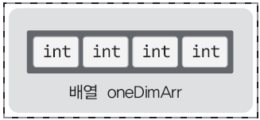

# **Chapter 11 1차원 배열**

> ## 11-1 배열의 이해와 배열의 선언 및 초기화 방법

<br>

**배열이란 무엇인가?**

* 배열을 사용하면 그 수에 상관없이 한번에 많은 수의 변수를 선언할 수 있음
* 배열은 단순히 다수의 변수 선언을 대신하지 않음  
다수의 변수로는 할 수 없는 일을 배열 선언을 통해 할 수 있음
* 배열은 선언방식에 따라서 1차원 구조가 될 수도 있고, 2차원 구조가 될 수도 있음

<br>

**1차원 배열의 선언에 필요한 것 세 가지: 배열이름, 자료형, 길이정보**

* `int oneDimArr \[4\];`  
\- int&nbsp; &nbsp; &nbsp; &nbsp; &nbsp; &nbsp; &nbsp; &nbsp; &nbsp; &nbsp; &nbsp; 배열을 이루는 요소(변수)의 자료형  
\- oneDimArr &nbsp; &nbsp; &nbsp; &nbsp; 배열의 이름  
\- \[4\]&nbsp; &nbsp; &nbsp; &nbsp; &nbsp; &nbsp; &nbsp; &nbsp; &nbsp; &nbsp; &nbsp; 배열의 길이  
종합) int형 변수 4개로 이뤄진 배열을 선언하되, 그 배열의 이름은 oneDimArr로 해라!  
  
&nbsp; &nbsp; &nbsp; &nbsp; &nbsp; &nbsp; &nbsp; &nbsp; &nbsp; &nbsp; &nbsp; &nbsp; &nbsp; &nbsp; <sup> 생성되는 배열의 형태 </sup>
* 다양한 자료형과 다양한 길이의 1차원 배열  
\- `int arr1\[7\];` &nbsp; &nbsp; &nbsp; &nbsp; &nbsp; &nbsp; &nbsp; &nbsp; &nbsp;// 길이가 7인 int형 1차원 배열 arr1  
\- `float arr2\[10\];` &nbsp; &nbsp; &nbsp; &nbsp; &nbsp; &nbsp; // 길이가 10인 float형 1차원 배열 arr2  
\- `double arr3\[12\];` &nbsp; &nbsp; &nbsp; &nbsp; // 길이가 12인 double형 1차원 배열 arr3
* 배열의 길이정보는 상수로!  
: 변수를 이용한 배열의 길이선언 (ex. `int len = 20; int arr\[len\];`) 도 가능한 컴파일러도 있지만 아닌 컴파일러도 존재

<br>

**선언된 1차원 배열의 접근**

```c
#include <stdio.h>

int main(void)
{
    int arr[5];
    int sum = 0, i;
    
    arr[0]=10, arr[1]=20, arr[2]=30, arr[3]=40, arr[4]=50;
    
    for(i=0; i<5; i++)
        sum += arr[i];
        
    printf("배열요소에 저장된 값의 합: %d \n", sum);
    return 0;
}
```
```
[실행결과]  
배열요소에 저장된 값의 합: 150
```

* **'인덱스' 또는 '인덱스** **값'**  
: \[ \] 연산자 사이에 들어가는 숫자 (배열의 위치정보 명시)
* **배열의 위치 정보를 명시하는 인덱스 값은 1이 아닌 0에서부터 시작**  
( ∴ `arr\[idx\] = 20;` &nbsp; &nbsp; &nbsp; &nbsp; // 배열 arr의 idx+1번째 요소에 20 저장 )
* 배열의 모든 요소는 **반복문을 이용한 순차적 접근** 가능  
(다수의 변수를 선언해서는 반복문 기반의 순차적 접근 불가능)

<br>

**배열! 선언과 동시에 초기화하기**

* 방법1  
`int arr\[5\] = {1, 2, 3, 4, 5};` &nbsp; &nbsp; &nbsp; &nbsp; &nbsp; &nbsp; &nbsp; &nbsp; &nbsp;// 순차적으로 1, 2, 3, 4, 5로 초기화
* 방법2  
`int arr2\[ \] = {1, 2, 3, 4, 5, 6, 7};` &nbsp; &nbsp; &nbsp; &nbsp; // 컴파일러에 의해서 자동으로 7 삽입
* 방법3  
`int arr3\[5\] = {1, 2};` &nbsp; &nbsp; &nbsp; &nbsp; &nbsp; &nbsp; &nbsp; &nbsp; &nbsp; &nbsp; &nbsp; &nbsp; &nbsp; // 3, 4, 5번째 배열요소는 0으로 채워짐

```c
#include <stdio.h>

int main(void)
{
    int arr1[5] = {1, 2, 3, 4, 5};
    int arr2[ ] = {1, 2, 3, 4, 5, 6, 7};
    int arr3[5] = {1, 2};
    int ar1Len, ar2Len, ar3Len, i;
    
    printf("배열 arr1의 크기: %d \n", sizeof(arr1));
    printf("배열 arr2의 크기: %d \n", sizeof(arr2));
    printf("배열 arr3의 크기: %d \n", sizeof(arr3));
    
    ar1Len = sizeof(arr1) / sizeof(int);    // 배열 arr1의 길이 계산
    ar2Len = sizeof(arr2) / sizeof(int);    // 배열 arr2의 길이 계산
    ar3Len = sizeof(arr3) / sizeof(int);    // 배열 arr3의 길이 계산
    
    for(i = 0; i < ar1Len; i++)
        printf("%d ", arr1[i]);
    printf("\n");
    
    for(i = 0; i < ar2Len; i++)
        printf("%d ", arr2[i]);
    printf("\n");
    
    for(i = 0; i < ar3Len; i++)
        printf("%d ", arr3[i]);
    printf("\n");
    
    return 0;
}
```
```
[실행결과]  
배열 arr1의 크기: 20  
배열 arr2의 크기: 28  
배열 arr3의 크기: 20  
1 2 3 4 5  
1 2 3 4 5 6 7  
1 2 0 0 0
```

* 배열의 이름을 대상으로 하는 sizeof 연산의 결과로는 '**바이트 단위의 배열 크기**'가 반환됨
* 배열의 크기가 아닌, 길이를 계산하고 싶다면 배열의 크기를 자료형의 바이트로 나눠줘야 함  
( `sizeof(배열이름) / sizeof(자료형)` )

<br>

> ## 문제 11-1 \[1차원 배열의 활용\]

문제1

```c
#incldue <stdio.h>

int main(void)
{
    int arr[5];
    int i, big, small, sum;
    
    for(i = 0; i < 5; i++)
    {
        printf("%d번째 입력: ", i+1);
        scanf("%d", &arr[i]);
    }
    
    big = small = sum = arr[0];
    
    for(i = 1; i < 5; i++)
    {
        sum = sum + arr[i];
        if (big < arr[i])
            big = arr[i];
        if (small > arr[i])
            small = arr[i];
    }
    
    printf("최댓값: %d \n", big);
    printf("최솟값: %d \n", small);
    printf("총 합: %d \n", sum);
```

문제2

```c
#include <stdio.h>

int main(void)
{
    char arr[ ] = {'G', 'o', 'o', 'd', ' ', 't', 'i', 'm', 'e'};
    int i;
    int arrLen = sizeof(arr) / sizeof(char);
    
    for (i = 0; i < arrLen; i++)
        printf("%c", arr[i]);
    printf("\n");
    
    return 0;
}
```

<br>

> ## 11-2 배열을 이용한 문자열 변수의 표현

<br>

**char형 배열의 문자열 저장과 '널(null)' 문자**

* `char str\[ \] = "Good morning!";`  
  
문자열 끝에 '\\0'이라는 특수문자 자동 삽입 -> 문자열의 길이는 13이 아닌 14
* 널(null) 문자  
: 문자열의 끝에 자동으로 삽입되는 문자 ' \\0 '

```c
#include <stdio.h>

int main(void)
{
    char str[ ] = "Good morning!";
    printf("배열 str의 크기: %d \n", sizeof(str));
    printf("널 문자 문자형 출력: %c \n", str[13]);
    printf("공백 문자 문자형 출력: %c \n", str[4]);
    printf("널 문자 정수형 출력: %d \n", str[13]);
    printf("공백 문자 정수형 출력: %d \n", str[4]);
    
    str[12] = '?';    // 배열 str에 저장된 문자열 데이터 변경
    printf("문자열 출력: %s \n", str);
    return 0;
}
```
```
[출력결과]  
배열 str의 크기: 14  
널 문자 문자형 출력: 
공백 문자 문자형 출력: 
널 문자 정수형 출력: 0  
공백 문자 정수형 출력: 32  
문자열 출력: Good morning?
```

* **'널 문자' ≠ '공백 문자'**  
널 문자의 아스키 코드 값은 0, 공백 문자의 아스키 코드 값은 32로 둘은 엄연히 다른 문자임  
널 문자는 '\\0'으로 표시하고 공백 문자는 ' '로 표시
* 배열에 저장된 데이터 변경 가능

<br>

**scanf 함수를 이용한 문자열의 입력**

```c
#include <stdio.h>

int main(void)
{
    char str[50];
    int idx = 0;
    
    printf("문자열 입력: ");
    scanf("%s", str);    // 문자열을 입력 받아서 배열 str에 저장!
    printf("입력 받은 문자열: %s \n", str);
    
    printf("문자 단위 출력: ");
    while(str[idx] != '\0')
    {
        printf("%c", str[idx]);
        idx++;
    }
    printf("\n");
    return 0;
}
```

* `scanf("%s", str);`  
: 문자열을 입력 받는 배열의 이름 앞에는 & 연산자를 붙이지 않음
* scanf 함수 호출을 통해서 입력받은 문자열의 끝에도 널 문자가 삽입됨
* 배열에 저장되는 문자열뿐만 아니라 **C언어에서 표현하는 모든 문자열의 끝에는 널 문자가 자동으로 삽입됨**  
`printf("Hi~");` 와 같이 큰 따옴표로 묶어서 문자열을 표현하면, 메모리 상에는 다음의 형태로 문자열 저장됨  
| H | i | ~ | \\n |&nbsp; &nbsp; &nbsp; &nbsp;(널 문자 삽입됨)
* 널 문자의 존재여부는 문자열의 판단여부가 됨  
`char arr1\[ \] = {'H', 'i', '\~'};` &nbsp; &nbsp; &nbsp; &nbsp; &nbsp; &nbsp; &nbsp; &nbsp;// 마지막에 널 문자가 없으므로 **문자 배열**  
`char arr2\[ \] = {'H', 'i', '\~', '\\0'};` &nbsp; &nbsp; &nbsp; &nbsp; // 마지막에 널 문자가 있으므로 **문자열**

<br>

**문자열의 끝에 '널(null)' 문자가 필요한 이유**

* 배열의 시작위치에 문자열이 저장되기 시작하기 때문에 시작위치는 확인 가능하지만,  
배열의 끝이 문자열의 끝이 아니므로 널 문자가 삽입되지 않으면 문자열의 끝은 확인 불가능
* 널 문자를 이용해서 문자열의 끝 표시!

```c
#include <stdio.h>

int main(void)
{
    char str[50] = "I like C programming";
    printf("string: %s \n", str);
    
    str[8] = '\0';    // 9번째 요소에 널 문자 저장
    printf("string: %s \n", str);
    
    str[6] = '\0';    // 7번째 요소에 널 문자 저장
    printf("string: %s \n", str);
    
    str[1] = '\0';    // 2번째 요소에 널 문자 저장
    printf("string: %s \n", str);
    
    return 0;
}
```
```
[실행결과]  
string: I like C programming  
string: I like C  
string: I like  
string: I
```

* 문자열의 중간에 널 문자를 삽입해서 문자열의 끝 변경
* 변경된 끝을 기준으로 문자열이 출력됨

<br>

참고) 널 문자의 아스키 코드 값은 0이므로 다음 두 문장은 동일한 문장!  
&nbsp; &nbsp; &nbsp; &nbsp; `str\[8\] = '\\0';`  
&nbsp; &nbsp; &nbsp; &nbsp; `str\[8\] = 0;`

<br>

**scanf 함수의 문자열 입력특성**

```c
#include <stdio.h>

int main(void)
{
    char str[50];
    int idx = 0;
    
    printf("문자열 입력: ");
    scanf("%s", str);    // 문자열을 입력 받아서 배열 str에 저장!
    printf("입력 받은 문자열: %s \n", str);
    
    printf("문자 단위 출력: ");
    while(str[idx] != '\0')
    {
        printf("%c", str[idx]);
        idx++;
    }
    printf("\n");
    return 0;
}
```
```
[실행결과]  
문자열 입력: He is my friend  
입력 받은 문자열: He  
문자 단위 출력: He
```

* scanf 함수가 데이터를 구분 짓는 기준은 공백이기 때문에  
'He', 'is', 'my', 'friend' 총 4개의 문자열이 입력된 것으로 인식
* scanf 함수는 문장을 입력 받기에는 적절하지 않음

<br>

> ## 문제 11-2 \[배열기반의 문자열 표현\]

문제1

```c
#include <stdio.h>

int main(void)
{
    char str[100];
    int strLen = 0, i = 0;

    printf("영단어 1개 입력: ");
    scanf("%s", str);

    for (i = 0; str[i] != '\0'; i++)
        strLen += 1;

    printf("영단어 길이: %d \n", strLen);

    return 0;
}
```

문제2

```c
#include <stdio.h>

int main(void)
{
    char str[100];
    char rts[100];
    int len = 0, i = 0;
    
    printf("영단어 입력: ");
    scanf("%s", str);
    
    while (str[len] != 0)
        len++;
    
    for (i = 0; i < len/2; i++)
    {
        rts[i] = str[len-i];
        rts[len-i] = str[i];
    }
    
    printf("뒤집힌 영단어: %s \n", rts);
    
    return 0;
}
```

문제3

```c
#include <stdio.h>

int main(void)
{
    char str[100];
    int big, i;
    
    printf("영단어 입력: ");
    scanf("%s", str);
    
    big = str[0];
    for (i = 1; i<100; i++)
        if (str[i] > big)
            big = str[i];
    
    printf("아스키 코드 값이 가장 큰 문자: %c \n", big);
    
    return 0;
}
```

<br>
<br>
<br>
<br>
<br>
출처: 윤성우의 열혈 C 프로그래밍
