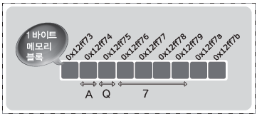
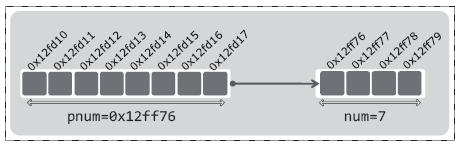
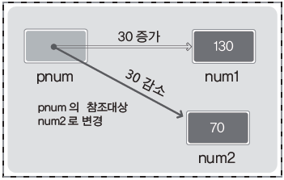

# Chapter 12 포인터의 이해

> ## 12-1 포인터란 무엇인가?

<br>

**주소 값의 저장을 목적으로 선언되는 포인터 변수**

```c
int main(void)
{
    char ch1 = 'A', ch2 = 'Q';
    int num = 7;
    ····
}
```

* 총 6바이트(1바이트 + 1바이트 + 4바이트)가 메모리 공간에 할당됨

    * char형 변수 ch1은 0x12ff74번지에 할당되어 있음
    * char형 변수 ch2는 0x12ff75번지에 할당되어 있음
    * int형 변수 num은 0x12ff76번지에 할당되어 있음  
    (int형 변수는 4바이트이므로 변수의 끝은 쉽게 알 수 있기 때문에  
    C언어에서는 **시작번지만을 가지고 위치 표현**)
    * **포인터 변수**  
    : 메모리의 주소 값을 저장하기 위한 변수

<br>

**포인터 변수와 & 연사자에 대해서 간단히 맛보기!**

```c
int main(void)
{
    int num = 7;
    int* pnum;      // 포인터 변수 pnum의 선언
    pnum = &num;    // num의 주소 값을 포인터 변수 pnum에 저장
    ····
}
```

* 정수 7이 저장된 int형 변수 num을 선언하고  
이 변수의 주소 값 저장을 위한 포인터 변수 pnum을 선언하고  
pnum에 변수 num의 주소 값을 저장하자
* `int* pnum;`  
\- `int*` &nbsp; &nbsp; &nbsp; &nbsp; &nbsp; &nbsp; int형 변수의 주소 값을 저장하는 포인터 변수의 선언  
\- `pnum` &nbsp; &nbsp; &nbsp; &nbsp; 포인터 변수의 이름
* `pnum = &num;`  
\- & 연산자: 오른쪽에 등장하는 피연산자의 주소 값을 반환하는 연산자  
\- & 연산의 결과로 변수 num의 주소 값이 반환되며, 이를 포인터 변수 pnum에 저장 (시작번지 주소 값 저장)  
\- **"포인터 변수 pnum이 int형 변수 num을 가리킨다"** 라고 표현  
    
    * 위 그림에서 변수 num의 크기는 4바이트(32비트)인데 포인터 변수 pnum의 크기는 8바이트(64비트)로 묘사됨  
    (포인터 변수의 크기는 4바이트가 될 수도 있고 8바이트가 될 수도 있음)  
    * 포인터 변수의 크기는 시스템의 주소 값 크기에 따라 다름  
    16비트 시스템 → 주소 값 크기 16비트 → 포인터 변수의 크기 16비트  
    32비트 시스템 → 주소 값 크기 32비트 → 포인터 변수의 크기 32비트

<br>

**포인터 변수 선언하기**

* **주소 값은 동일한 시스템에서 그 크기가 동일하며 모두 정수 형태**이지만,  
**가리키고자 하는 변수의 자료형에 따라서 선언하는 방법이 달라짐**  
(이유는 메모리 접근과 관련 있음)
* `type* ptr;`  
: type형 변수의 주소 값을 저장하는 포인터 변수 ptr의 선언  
\- `int* pnum1;`  
&nbsp; : int\* 는 int형 변수를 가리키는 pnum1의 선언 의미  
\- `double* pnum2;`  
&nbsp; : double\* 는 double형 변수를 가리키는 pnum2의 선언 의미  
\- `unsigned int* pnum3;`  
&nbsp; : unsigned int\* 는 unsigned int형 변수를 가리키는 pnum3의 선언 의미

<br>

**포인터의 형(Type)**

-   `type*` &nbsp; &nbsp; &nbsp; &nbsp; &nbsp; &nbsp; &nbsp; type형 포인터
-   `type* ptr;` &nbsp; &nbsp; &nbsp; &nbsp; type형 포인터 변수 ptr

참고) \* 의 위치는 상관 없음 (아래의 선언 모두 동일한 의미)  
&nbsp; &nbsp; &nbsp; &nbsp; `double * ptr;`  
&nbsp; &nbsp; &nbsp; &nbsp; `double* ptr;`  
&nbsp; &nbsp; &nbsp; &nbsp; `double *ptr;`

<br>

> ## 12-2 포인터와 관련 있는 연산자: & 연산자와 \* 연산자

<br>

**변수의 주소 값을 반환하는 & 연산자**

```c
int main(void)
{
    int num = 5;
    int* pnum = &num;    // num의 주소 값을 반환해서 포인터 변수 pnum 초기화
    
    int num1 = 5;
    double* pnum1 = &num1;    // 자료형이 일치하지 않음!
    
    double num2 = 5;
    int* pnum2 = &num2;       // 자료형이 일치하지 않음!
}
```

* **& 연산자**  
: **변수**의 주소 값 반환
* & 연산자의 피연산자는 변수이어야 하며, 상수는 피연산자가 될 수 없음
* 변수의 자료형에 맞지 않는 포인터 변수의 선언은 문제가 될 수 있음  
(컴파일 에러는 발생하지 않지만(경고 메시지는 발생) 포인터 관련 \* 연산 시 문제 발생)

<br>

**포인터가 가리키는 메모리를 참조하는 \* 연산자**

* 여기서 말하는 \* 연산자는 곱셈 연산자를 뜻하는 것이 아님  
(곱셈 연산자는 피연산자가 2개인 이항 연산자인 반면, 포인터 관련 \* 연산자는 피연산자가 1개인 단항 연산자)

```c
int main(void)
{
    int num = 10;
    int* pnum = &num;       // 포인터 변수 pnum이 변수 num을 가리키게 하는 문장
    *pnum = 20;             // pnum이 가리키는 변수에 20을 저장하라!
    printf("%d", *pnum);    // pnum이 가리키는 변수를 부호 있는 정수로 출력하라!
    ····
}
```

* `*pnum = 20;`  
: 포인터 변수 pnum이 가리키는 메모리 공간인 변수 num에 정수 20을 저장해라!
* `printf("%d", *pnum);`  
: 포인터 변수 pnum이 가리키는 메모리 공간인 변수 num에 저장된 값을 출력해라!
* 사실상 `*pnum`은 포인터 변수 pnum이 가리키는 변수 num을 의미

```c
#include <stdio.h>

int main(void)
{
    int num1 = 100, num2 = 100;
    int* pnum;
    
    pnum = &num1;     // 포인터 pnum이 num1을 가리킴
    (*pnum) += 30;    // num1 += 30; 과 동일
    
    pnum = &num2;     // 포인터 pnum이 num2를 가리킴
    (*pnum) -= 30;    // num2 -= 30; 과 동일
    
    printf("num1: %d, num2: %d \n", num1, num2);
    
    return 0;
}
```
```
[실행결과]  
num1: 130, num2: 70
```

* `pnum = &num2;`  
: pnum도 변수이기 때문에 저장된 값의 변경 가능  
&nbsp; (포인터 변수 pnum이 가리키는 대상이 num1에서 num2로 변경됨)
* 포인터 변수의 참조관계  
    


참고) 한 문장 안에서의 변수와 포인터 변수의 선언( `int num, *pnum;` )도 가능은 하지만 문장을 달리해서 선언하는 것이 좋음

<br>

**다양한 '포인터 형'이 존재하는 이유!**

* 포인터의 형은 메모리 공간을 참조하는 기준이 됨  
( \* 연산자를 통한 메모리 공간의 접근 기준을 마련하기 위해 포인터 형 정의)

```c
int main(void)
{
    double num = 3.14;
    int* pnum = &num;       // 형(type)의 불일치
    printf("%d", *pnum);    // 예측 불가능한 의미 없는 출력
    ····
}
```

* int형 포인터 변수 pnum은 double형 변수 num을 가리키게 됨  
(pnum이 가리키는 것은 double형 변수 num인데, pnum이 int형 포인터 변수이므로 int형 데이터처럼 해석)
* pnum이 가리키는 메모리 공간에 저장된 값을 얻기 위해서 \* 연산을 하는 경우  
"4바이트를 읽어 들여서 이를 정수로 해석한다"를 의미하게 됨
* 즉, 실제 저장할 때는 8바이트 크기의 실수형 데이터로 저장 했는데 해석은 엉뚱하게 해버린 셈  
(얼마가 출력될지 예측이 불가능할 뿐만 아니라, 이렇게 해석해서 얻게 되는 정수 값은 아무 의미도 없는 값일 뿐)

<br>

**잘못된 포인터의 사용과 널 포인터**

```c
/* 잘못된 포인터의 사용 1 */
int main(void)
{
    int* ptr;    // 포인터 변수 ptr은 쓰레기 값으로 초기화 됨
    *ptr = 200;
    ····
}
```

* 포인터 변수를 선언만 하고 초기화 하지 않으면, 포인터 변수는 쓰레기 값으로 초기화 됨  
(어디를 가리킬지 모르게 됨)
* 이러한 상태에서 \* 연산을 통해 200을 저장하는 것은 치명적 결과로 이어질 수 있음  
(만약 ptr이 가리키는 위치가 매우 중요한 위치였다면? 으아아아악)

```c
/* 잘못된 포인터의 사용 2 */
int main(void)
{
    int* ptr = 125;    // 125번지가 어딘 줄 알고?
    *ptr = 10;
    ····
}
```

* 포인터 변수 ptr을 초기화 한답시고 125를 저장하였으나, 125번지가 어디인지 나는 모름  
(쓰레기 값으로 포인터 변수를 초기화 한 것)

<br>

포인터 변수를 우선 선언만 해 놓고, 이후에 유효한 주소 값을 채워 넣을 생각이라면, **널(NULL) 포인터를 사용**하기!

```c
/* 안전한 코드 */
int main(void)
{
    int* ptr1 = 0;
    int* ptr2 = NULL;    // NULL은 사실상 0을 의미
    ····
}
```

* `int* ptr1 = 0;`  
: ptr1을 초기화하는 값 0을 가리켜 '**널 포인터**'라 함  
&nbsp; 이는 0번지를 의미하는 것이 아니라, '아무데도 가리키지 않는다!'를 의미
* `int* ptr2 = NULL;`  
: 키워드 NULL은 널 포인터를 의미하며, 상수 0으로 정의되어 있음

<br>

> ## 문제 12-1 \[포인터의 이해\]

문제1

```
답: 12
```

문제2

```c
#include <stdio.h>

int main(void)
{
    int num1 = 10, num2 = 20;
    int* ptr1 = &num1;
    int* ptr2 = &num2;
    int* z;
    
    (*ptr1) += 10;
    (*ptr2) -= 10;
    
    z = ptr2;
    ptr2 = ptr1;
    ptr1 = z;
    
    printf("ptr1: %d, ptr2: %d \n", *ptr1, *ptr2);
    
    return 0;
}
```

<br>
<br>
<br>
<br>
<br>
출처: 윤성우의 열혈 C 프로그래밍
