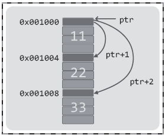
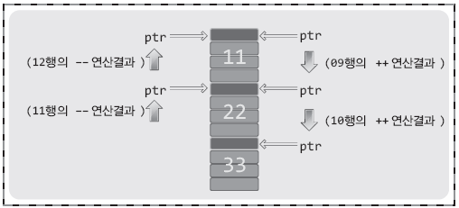
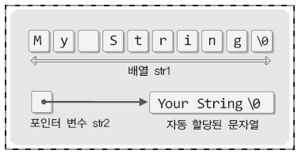
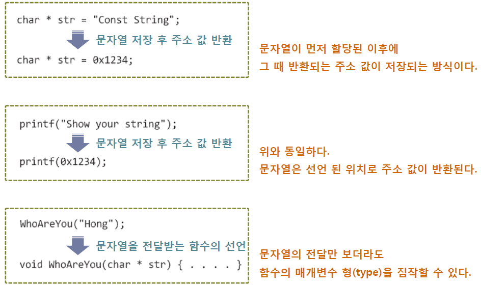

# **Chapter 13 포인터와 배열! 함께 이해하기**

> ## 13-1 포인터와 배열의 관계

<br>

**배열의 이름은 무엇을 의미하는가?**
```c
# include <stdio.h>

int main(void)
{
    int arr[3] = {0, 1, 2};
    printf("배열의 이름: %p \n", arr);
    printf("첫 번째 요소: %p \n", &arr[0]);
    printf("두 번째 요소: %p \n", &arr[1]);
    printf("세 번째 요소: %p \n", &arr[2]);
    // arr = &arr[i];   // 이 문장은 컴파일 에러를 일으킨다.
    return 0;
}
```
```
[실행결과]
배열의 이름: 0012FF50
첫 번째 요소: 0012FF50
두 번째 요소: 0012FF54
세 번째 요소: 0012FF58
```

* `%p`  
: 주소 값의 출력에 사용되는 서식문자
* int형 배열요소간 주소 값의 차는 4바이트
* 모든 배열요소가 메모리 공간에 나란히 할당됨
* 배열의 이름은 배열의 시작 주소 값을 의미하며, 그 형태는 값의 저장이 불가능한 상수임  
(배열의 이름은 **상수 형태의 포인터** (**포인터 상수**))
* 배열의 이름도 포인터이기 때문에 배열의 이름을 피연산자로 하는 * 연산 가능

<br>

|   | 포인터 변수 | 배열의 이름 |
| --- | --- | --- |
| 이름이 존재하는가? | 존재한다 | 존재한다 | 
| 무엇을 나타내거나 저장하는가? | 메모리의 주소 값 | 메모리의 주소 값 |
| 주소 값의 변경이 가능한가? | 가능하다 | 불가능하다 |
* 배열의 이름과 포인터 변수는 상수냐 변수냐의 차이만 있음

<br>

**1차원 배열이름의 포인터 형과 배열이름을 대상으로 하는 * 연산**
* 1차원 배열이름의 포인터 형은 배열의 이름이 가리키는 대상을 기준으로 결정  
\- `int arr1[5];` &nbsp; &nbsp; &nbsp; &nbsp; &nbsp; &nbsp; &nbsp; &nbsp;arr1은 int형 포인터 상수  
\- `double arr2[7];` &nbsp; &nbsp; &nbsp; &nbsp; arr2는 double형 포인터 상수

```c
#include <stdio.h>

int main(void)
{
    int arr1[3] = {1, 2, 3};
    double arr2[3] = {1.1, 2.2, 3.3};

    printf("%d %g \n", *arr1, *arr2;

    *arr1 += 100;      // 배열 이름을 대상으로 포인터 연산
    *arr2 += 120.5;    // 배열 이름을 대상으로 포인터 연산

    printf("%d %g \n", arr1[0], arr2[0]);

    return 0;)
}
```
```
[실행결과]
1  1.1
101  121.6
```
* `*arr1`  
: arr1이 가리키는 배열의 첫 번째 요소
* `*arr2`  
: arr2가 가리키는 배열의 첫 번째 요소

<br>

**포인터를 배열의 이름처럼 사용할 수도 있다**
```c
int main(void)
{
    int arr[3] = {1, 2, 3};
    arr[0] += 5;
    arr[1] += 7;
    arr[2] += 9;
    // 위 문장들은 포인터를 대상으로 문장을 구성한 셈
}
```
* 위 코드에서 배열이름 arr은 int형 포인터이고,  
포인터를 대상으로 배열의 모든 요소를 arr[0], arr[1], arr[2]로 접근한 셈
* 포인터 변수를 대상으로도 이러한 형태의 접근 가능!  
(ex. 포인터 변수 ptr을 대상으로 ptr[0], ptr[1], ptr[2]와 같이 배열의 형태로 메모리 공간에 접근 가능)
* 배열의 이름과 포인터 변수는 상수냐 변수냐의 차이만 있을 뿐, 둘 다 포인터임  
(∴ 포인터 변수로 할 수 있는 연산은 배열의 이름으로도 할 수 있고,  
&nbsp; &nbsp; 배열의 이름으로 할 수 있는 연산은 포인터 변수로도 할 수 있음)

```c
#include <stdio.h>

int main(void)
{
    int arr[3] = {15, 25, 35};
    int *ptr = &arr[0];     // int *ptr = arr; 과 동일한 문장

    printf("%d %d \n", ptr[0], arr[0]);
    printf("%d %d \n", ptr[1], arr[1]);
    printf("%d %d \n", ptr[2], arr[2]);
    printf("%d %d \n", *ptr, *arr);
    
    return 0;
}
```
```
[실행결과]
15  15
25  25
35  35
15  15
```
참고) 포인터 변수를 배열의 이름처럼 사용하는 경우는 거의 없고,  
&nbsp; &nbsp; &nbsp; &nbsp; &nbsp; 마찬가지로 배열의 이름을 포인터 변수처럼 사용하는 경우도 거의 없음

<br>

> ## 13-2 포인터 연산

<br>

**포인터를 대상으로 하는 증가 및 감소연산**
```c
#include <stdio.h>

int main(void)
{
    int *ptr1 = 0x0010;
    double *ptr2 = 0x0010;

    printf("ptr1 & ptr2 = %p & %p \n", ptr1, ptr2);

    printf("ptr1+1 & ptr1+2 = %p & %p \n", ptr1+1, ptr1+2);    // 4 증가 & 8 증가
    printf("ptr2+1 & ptr2+2 = %p & %p \n", ptr2+1, ptr2+2);    // 8 증가 & 16 증가

    ptr1++;    // 4 증가
    ptr2++;    // 8 증가

    printf("ptr1++ & ptr2++ = %p & %p \n", ptr1, ptr2);

    return 0;
}
```
```
[실행결과]
ptr1  &  ptr2  =  00000010  &  00000010
ptr1+1  &  ptr1+2  =  00000014  &  00000014
ptr2+1  &  ptr2+2  =  00000018  &  00000018
ptr1++  &  ptr2++  =  00000014  &  00000018
```

* TYPE형 포인터를 대상으로 n 만큼 값을 증가 및 감소  
→ n \* sizeof(TYPE) 의 크기만큼 주소 값이 증가 및 감소
* 포인터 연산으로 배열 접근 가능
    ```c
    #include <stdio.h>

    int main(void)
    {
        int arr[3] = {11, 22, 33};
        int *ptr = arr;    // int *ptr = &arr[0] 과 같은 문장

        printf*"%d %d %d \n", *ptr, *(ptr+1), *(ptr+2);

        printf("%d ", *ptr); ptr++;    // printf 함수 호출 후, ptr++ 실행
        printf("%d ", *ptr); ptr++;    // printf 함수 호출 후, ptr++ 실행
        printf("%d ", *ptr); ptr--;    // printf 함수 호출 후, ptr-- 실행
        printf("%d ", *ptr); ptr--;    // printf 함수 호출 후, ptr-- 실행
        printf("%d ", *ptr); printf("\n");

        return 0;
    }
    ```
    ```
    [실행결과]
    11  22  33
    11  22  33  22  11
    ```
    * `*(ptr+1)` 과 `*(ptr+++)` 은 모두 현재 ptr이 가리키는 위치에서 4바이트 떨어진 메모리 공간을 나타내지만,  
    + 연산 후에는 ptr에 저장된 값이 증가하지 않는 반면, ++ 연산 후에는 ptr에 저장된 값이 증가
    * \+ 연산  
        
    * \++ 연산  
        

<br>

**중요한 결론! arr[i] == \*(arr+i)**
```c
int *ptr=arr;

printf("%d %d %d \n", *(ptr+0), *(ptr+1), *(ptr+2));
printf("%d %d %d \n", , ptr[0], ptr[1], ptr[2]);
printf("%d %d %d \n", *(arr+0), *(arr+1), *(arr+2));
printf("%d %d %d \n", arr[0], arr[1], arr[2]);
```

* 위의 네가지 printf 문은 사실상 같은 것이며 동일한 출력 결과를 보임
* **`arr[i]` 는 `*(arr+i)` 와 같다**

<br>

> ## 문제 13-1 [포인터를 이용한 배열의 접근]
문제1
```c
#include <stdio.h>

int main(void)
{
    int arr[5] = {1, 2, 3, 4, 5};
    int *ptr = arr;
    int i;

    for (i=0; i<5; i++)
    {
        *ptr += 2;
        ptr++;
    }

    for (i=0; i<5; i++)
        printf("%d ", arr[i]);

    return 0;
}
```

문제2
```c
#include <stdio.h>

int main(void)
{
    int arr[5] = {1, 2, 3, 4, 5};
    int *ptr = arr;
    int i;

    for (i=0; i<5; i++)
        *(ptr+i) += 2;
    
    for (i=0; i<5; i++)
        printf("%d ", arr[i]);

    return 0;
}
```

문제3
```c
#include <stdio.h>

int main(void)
{
    int arr5 = {1, 2, 3, 4, 5};
    int *ptr = &arr[4];
    int i;
    int sum=0;

    for (i=0; i<5; i++)
    {
        sum += *ptr;
        ptr--;
    }

    printf("%d \n", sum);

    return 0;
}
```

문제4
```c
#include <stdio.h>

int main(void)
{
    int arr[6] = {1, 2, 3, 4, 5, 6};
    int *fp = &arr[0];
    int *bp = &arr[5];
    int i, temp;

    for (i=0; i<3; i++)
    {
        temp = *fp;
        *fp = *bp;
        *bp; = temp;
        fp++;
        bp--;
    }

    for (i=0; i<6; i++)
        printf("%d ", arr[i]);
    
    return 0;
}
```

<br>

> ## 13-3 상수 형태의 문자열을 가리키는 포인터

<br>

**두 가지 형태의 문자열 표현**  

* 문자열의 선언 방식  
    * 배열을 기반으로 하는 문자열의 선언 (= 변수 형태의 문자열)
        ```c
        char str1[] = "My String";    // 배열의 길이는 자동으로 계산됨
        ```

    * 포인터를 기반으로 하는 문자열의 선언 (= 상수 형태의 문자열)
        ```c
        char *str2 = "Your String";
        ```

* 변수 형태의 문자열과 상수 형태의 문자열의 차이  
  
\- str1은 그 자체로 문자열 전체를 저장하는 배열  
\- str2는 메모리상에 자동으로 저장된 문자열의 첫 번째 문자를 단순히 가리키고만 있는 포인터 변수  
\- str1과 str2 모두 문자열의 시작 주소 값을 담고 있다는 점은 동일  
\- 배열이름 str1은 항상 문자 M이 저장된 위치를 가리키는 상태이지만, (가리키는 대상 변경 불가)  
포인터 변수 str2는 다른 위치를 가리킬 수 있음 (가리키는 대상 변경 가능)  

    ```c
    #include <stdio.h>
    int main(void)
    {
        char str1[] = "My String";     // 변수 형태의 문자열
        char *str2 = "Your String";    // 상수 형태의 문자열
        printf("%s %s \n", str1, str2);

        str2 = "Our String";    // 가리키는 대상 변경
        printf("%s %s \n", str1, str2);

        str1[0] = 'X';    // 문자열 변경 성공!
        str2[0] = 'X';    // 문자열 변경 실패!
        printf("%s %s \n", str1, str2);

        return 0;
    }
    ```

<br>

**어디서든 선언할 수 있는 상수 형태의 문자열**  
"큰따옴표로 묶여서 표현되는 문자열은 그 형태에 상관 없이 메모리 공간에 저장된 후 그 주소 값이 반환된다"  


<br>

> ## 13-4 포인터 변수로 이뤄진 배열: 포인터 배열

<br>

**포인터 배열의 이해**

```c
#include <stdio.h>

int main(void)
{
    int num1=10, num2=20, num3=30;
    int *arr[3] = {&num1, &num2, &num3};

    printf("%d \n", *arr[0]);
    printf("%d \n", *arr[1]);
    printf("%d \n", *arr[2]);

    return 0;
}
```
```
[실행결과]
10
20
30
```

* **포인터 배열**  
: 포인터 변수로 이뤄진, 그래서 주소 값의 저장이 가능한 배열  
    ```c
    // 선언 방법
    int *arr1[20];       길이가 20인 int형 포인터 배열 arr1
    double *arr2[30];    길이가 30인 double형 포인터 배열 arr2
    ```
* `int *arr[3] = {&num1, &num2, &num3};`  
: int형 포인터 배열을 선언하고 변수 num1, num2, num3의 주소 값으로 초기화
* `printf("%d \n", *arr[0]);`  
: 배열요소가 가리키는 변수에 저장된 값 출력

<br>

**문자열을 저장하는 포인터 배열**  

```c
#include <stdio.h>

int main(void)
{
    char *strArr[3] = {"Simple", "String", "Arrayy"};
    printf("%s \n", strArr[0]);
    printf("%s \n", strArr[1]);
    printf("%s \n", strArr[2]);

    return 0;
}
```
```
[실행결과]
Simple
String
Array
```

* `char *strArr[3] = {"Simple", "String", "Arrayy"};`  
\- 초기화 리스트에 선언된 문자열들은 메모리 공간에 저장되고,  
&nbsp; 그 위치에 저장된 문자열의 주소 값이 반환됨  
&nbsp; (∵ 큰따옴표로 묶여서 표현되는 문자열은 그 형태에 상관 없이 메모리 공간에 저장된 후 그 주소 값이 반환됨)  
\- 문자열이 저장된 이후에는 다음의 형태가 됨  
&nbsp; `char *strArr[3] = {0x1004, 0x1048 0x2012};`

<br>
<br>
<br>
<br>
<br>
출처: 윤성우의 열혈 C 프로그래밍
