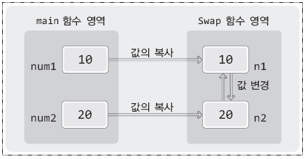

# **Chapter 14 포인터와 함수에 대한 이해**

> ## 14-1 함수의 인자로 배열 전달하기

<br>

**인자전달의 기본방식은 값의 복사이다!**  

### <center> " 함수 호출 시 전달되는 인자의 값은 매개변수에 **복사**된다 " </center>  

```c
int SimpleFunc(int num) {····}
int main(void)
{
    int age = 17;
    SimpleFunc(age);    // age에 저장된 값이 매개변수 num에 복사됨
    ····
}
```

* 실제로 전달되는 것은 age가 아닌, age에 저장된 값  
(age에 저장된 값이 매개변수 num에 복사되는 것)  
* SimpleFunc 함수 내에서 매개변수 num에 저장된 값을 1 증가시키더라도, 변수 age의 값은 변화 없음

<br>

**배열을 함수의 인자로 전달하는 방식**  

### <center> "배열의 주소값 전달" </center>  

```c
void SimpleFunc(int *param) {····}
{
    printf("%d %d", param[0], param[1]);    // 첫 번째, 두 번째 요소 출력!
    // 포인터 변수를 이용해서도 배열의 형태로 접근 가능
    ····
}

int main(void)
{
    int arr[3] = {1, 2, 3};
    SimpleFunc(arr);    // 배열이름 arr이 지니는 주소 값 전달
    ····
}

```

* 함수의 매개변수를 포인터 변수로 선언하면 됨
* 배열에 접근하여 저장된 값을 참조하는 것 뿐만 아니라, 변경하는 것도 가능

[통합 예제]  
```c
#include <stdio.h>

void ShowArrElem(int *param, int len)
{
    int i;
    for (i=0; i<len; i++)
        printf("%d ", param[i]);
    printf("\n");
}

void AddArrElem(int *param, int len, int add)
{
    int i;
    for (i=0; i<len; i++)
        param[i] += add;
}

int main(void)
{
    int arr[3] = {1, 2, 3};
    ShowArrElem(arr, sizeof(arr)/sizeof(int));

    AddArrElem(arr, sizeof(arr)/sizeof(int), 1);
    ShowArrElem(arr, sizeof(arr)/sizeof(int));

    AddArrElem(arr, sizeof(arr)/sizeof(int),5);
    ShowArrElem(arr, sizeof(arr)/sizeof(int));

    return 0;
}
```
```
[실행결과]
1  2  3
2  3  4
7  8  9
```

<br>

**배열을 함수의 인자로 전달받는 함수의 또 다른 선언**

```c
void ShowArrElem(int *param, int len) {····}
void AddArrElem(int *param, int len, int add) {····}
```  
위 선언은 아래의 선언과 같다  
```c
void ShowArrElem(int param[], int len) {····}
void AddArrElem(int param[], int len, int add) {····}
```  

* 배열을 인자로 전달받는 경우에는 ```int param[]```이 더 의미있어 보이므로 주로 사용

<br>

참고) 함수 내에서는 인자로 전달된 배열의 길이를 계산할 수 없음  
&nbsp; &nbsp; &nbsp; &nbsp; ( ∴ 배열의 길이도 계산해서 인자로 전달하는 것이 좋음)  

* 배열의 주소 값을 인자로 전달받는 매개변수는 포인터 변수이기 때문에 <br> 이를 대상으로 sizeof 연산을 할 경우 배열의 크기가 반환되지 않고 포인터 변수의 크기가 반환된다

<br>

> ## 14-2 Call-by-value vs. Call-by-reference

* **Call-by-value**  
: 값을 전달하는 형태의 함수호출:  
* **Call-by-reference**  
: 주소 값을 전달하는 형태의 함수호출

[ Call-by-value 의 문제점 ]
```c
#include <stdio.h>

void Swap(int n1, int n2)
{
    int temp = n1;
    n1 = n2;
    n2 = temp;
}

int main(void)
{
    int num1 = 10;
    int num2 = 20;
    printf("num1  num2 : %d  %d \n", num1, num2);

    Swap(num1, num2);
    printf("num1  num2 : %d  %d \n", num1, num2);

    return 0;
}
```
```
[실행결과]
num1  num2 : 10  20
num1  num2 : 10  20
```

* 두 번째 printf 에서 num1과 num2가 바뀌길 기대하고 Swap 함수를 설계했지만 원하는 결과가 아님!
* 이유: Swap 함수 내에서의 값의 교환은 외부에 영향을 주지 않기 때문  
( Swap 함수를 호출하면 num1과 num2에 저장된 값이 매개변수 n1과 n2에 복사되고,  
&nbsp; Swap 함수 내에서는 실제로 n1과 n2에 저장된 값의 변경이 일어나지만,  
&nbsp; 이는 매개변수 n1과 n2에 저장된 값을 변경시키는 것일 뿐,  
&nbsp; num1과 num2에 저장된 값의 변경으로까지 이어지지 않음  
    

[ 해결방안: Call-by-reference ]

```c
#include <stdio.h>

void Swap(int *ptr1, int *ptr2)
{
    int temp = *ptr1;
    *ptr1 = *ptr2;
    *ptr2 = temp;
}

int main(void)
{
    int num1 = 10;
    int num2 = 20;
    printf("num1  num2 : %d  %d \n", num1, num2);

    Swap(&num1, &num2);
    printf("num1  num2 : %d  %d \n", num1, num2);

    return 0;
}
```
```
[실행결과]
num1  num2 : 10  20
num1  num2 : 20  10
```

* num1과 num2의 주소 값을 Swap 함수로 전달해서 Swap 함수 내에서 num1과 num2에 직접 접근 (값 변경 가능)  

<br>

**scanf 함수 호출 시 & 연산자를 붙이는 이유**  

* scanf 함수의 호출도 Call-by-reference 형태의 함수호출에 해당  
    ```c
    int main(void)
    {
        int num;
        scanf("%d", &num);
        ····
    }
    ```
    * 외부에 선언된 변수 num에 접근하기 위해 num의 주소 값을 전달한 것  

* 문자열을 입력받을 때에는 & 연산자를 붙이지 않음  
    ```c
    int main(void)
    {
        char str[30];
        scanf("%s", str);    // scanf("%s", &str); 는 잘못된 문장 구성
        ····
    }
    ```
    * str을 전달하면 배열의 주소값이 전달되는 것이기 때문에 & 연산자를 붙일 이유가 없음

<br>

> ## 문제 14-1 \[Call-by-value & Call-by-reference\]

문제1

```c
#include <stdio.h>

int SquareByValue(int n)
{
    return n*n;
}

int SquareByReference(int *n)
{
    *n *= *n;
}

int main(void)
{
    int num;
    printf("제곱할 정수 입력: ");
    scanf("%d", &num);

    printf("Call-by-value 기반: %d \n", SquareByValue(num));

    SquareByReference(&num);
    printf("Call-by-reference 기반: %d \n", num);

    return 0;
}
```

문제2

```c
#include <stdio.h>

int Swap3(int *n1, int *n2, int *n3)
{
    int temp = *n1;
    *n1 = *n3;
    *n3 = *n2;
    *n2 = temp;
}

int main(void)
{
    int num1, num2, num3;
    printf("바꿀 정수 3개 입력: ");
    scanf("%d %d %d", &num1, &num2, &num3);

    Swap3(&num1, &num2, &num3);
    printf("%d %d %d \n", num1, num2, num3);

    return 0;
}
```

<br>

> ## 14-3 포인터 대상의 const 선언

* **const 선언** : 변수를 상수화할 때 사용 (포인터 변수를 대상으로도 선언 가능)

<br>

**포인터 변수가 참조하는 대상의 변경을 허용하지 않는 const 선언**

```c
int main(void)
{
    int num=20;
    const int *ptr = &num;
    *ptr = 30;    // 컴파일 에러
    num = 40;     // 컴파일 성공
    ····
}
```

* 맨 앞부분에서의 const 선언이 갖는 의미  
: 포인터 변수 ptr을 이용해서 ptr이 가리키는 변수에 저장된 값을 변경하는 것을 허용하지 않는다!
* 포인터 변수 ptr이 가리키는 변수 num이 상수화되는 것은 아님 ( ∴ 변수 num에 저장된 값을 변경하는 것은 허용)  
(ptr을 통한 변경만 허용 X )

<br>

**포인터 변수의 상수화**

```c
int main(void)
{
    int num1 = 20;
    int num2 = 30;
    int * const ptr = &num1;
    ptr = &num2;    // 컴파일 에러
    *ptr = 40;      // 컴파일 성공
    ····
}
```

* 포인터 변수의 이름 앞에서의 const 선언이 갖는 의미  
: 포인터 변수 ptr이 상수가 된다, 즉 한번 주소 값이 저장되면 그 값의 변경이 불가능하다!  
&nbsp; (한번 가리키기 시작한 변수를 끝까지 가리켜야 한다)

<br>

**두 가지 형태의 const 선언을 동시에 선언하는 경우**

```c
int main(void)
{
    int num = 10;
    const int * const ptr = &num;
    *ptr = 20;     // 컴파일 에러
    ptr = &age;    // 컴파일 에러
}
```

<br>

**const 선언이 갖는 의미**  
( const 선언 ↑ ) &nbsp; ⇒ &nbsp; ( 프로그램 코드의 안전성 ↑ )

<br>
<br>
<br>
<br>
<br>
출처: 윤성우의 열혈 C 프로그래밍
