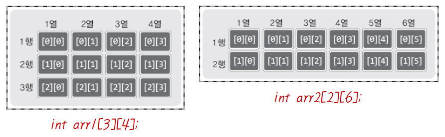
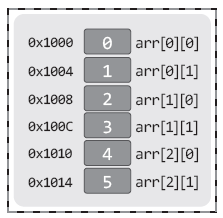
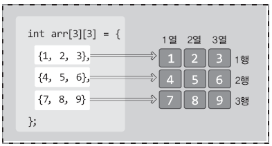
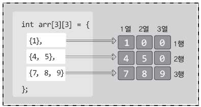
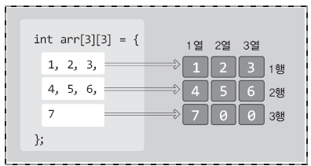
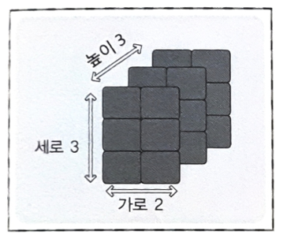

# **Chapter 16 다차원 배열**

> ## 16-1 다차원 배열의 이해와 활용

```c
int arrOneDim[10];           // 길이가 10인 1차원 int형 배열
int arrTwoDim[5][6];         // 세로 4, 가로 6인 2차원 int형 배열
int arrThreeDim[2][3][4];    // 높이 2, 세로 3, 가로 4인 3차원 int형 배열
```

<br>

**2차원 배열의 선언**

```c
int arr1[3][4];    // 세로가 3, 가로가 4인 int형 2차원 배열
int arr2[7][9];    // 세로가 7, 가로가 9인 int형 2차원 배열

printf("arr1 배열 크기: %d \n", sizeof(arr1));
printf("arr2 배열 크기: %d \n", sizeof(arr2));

return 0;
```
```
[실행결과]
arr1 배열 크기: 48
arr2 배열 크기: 252
```



* **2차원 배열의 선언형태**  
`TYPE arr[세로길이][가로길이];`  
(배열요소의 자료형: TYPE , 배열 이름: arr)

<br>

**2차원 배열요소의 접근**

```c
arr[N-1][M-1] = 20;             // 세로 N, 가로 M의 위치에 정수 20을 저장
printf("%d", arr[N-1][M-1]);    // 세로 N, 가로 M의 위치에 저장된 값 출력
```
<br>

\[예제\]

```c
#incldue <stdio.h>

int main(void)
{
    int villa[3][2];
    int popu, i, j;

    /* 가구별 거주인원 입력 받기 */
    for (i=0; i<3, i++)
    {
        for(j=0; j<2; j++)
        {
            printf("%d층 %d호 인구수: ", i+1, j+1);
            scanf("%d", villa[i][j]);
        }
    }

    /* 빌라의 층별 인구수 출력하기 */
    for (i=0; i<3; i++)
    {
        popu =0;
        popu += villa[i][0];
        popu ++ villa[i][1];
        printf("%d층 인구수: %d \n", i+1, popu);
    }

    return 0;
}
```
```
[실행결과]
1층 1호 인구수: 2
1층 2호 인구수: 4
2층 1호 인구수: 3
2층 2호 인구수: 5
3층 1호 인구수: 2
3층 2호 인구수: 6
1층 인구수: 6
2층 인구수: 8
3층 인구수: 8
```

<br>

**2차원 배열의 메모리상 할당의 형태**

* 2차원 배열도 메모리상에는 1차원의 형태로 존재  
      
    ```c
    #include <stdio.h>
    
    int main(void)
    {
        int arr[3][2];
        int i, j;
        for (i=0; i<3; i++)
            for (j=0; j<2; j++)
                printf("%p \n", &arr[i][j]);
                
        return 0;
    }
    ```
    ```
    [실행결과]
    002AFD54
    002AFD58
    002AFD5C
    002AFD60
    002AFD64
    002AFD68
    ```
    
    * 주소값은 int형 변수의 크기인 4바이트만큼만 차이가 남

<br>

**2차원 배열 선언과 동시에 초기화하기**

```c
#include <stdio.h>

int main(void)
{
    int i, j;

    /* 2차원 배열 초기화의 예 1 */
    int arr1[3][3] = {
        {1, 2, 3},
        {4, 5, 6},
        {7, 8, 9}
    };

    /* 2차원 배열 초기화의 예 2 */
    int arr2[3][3] = {
        {1},
        {4, 5},
        {7, 8, 9}
    };

    /* 2차원 배열 초기화의 예 3 */
    int arr3[3][3] = {1, 2, 3, 4, 5, 6, 7};

    for (i=0; i<3; i++)
    {
        for (j=0; j<3; j++)
            printf("%d ", arr1[i][j]);
        printf("\n");
    }

    for (i=0; i<3; i++)
    {
        for (j=0; j<3; j++)
            printf("%d ", arr2[i][j]);
        printf("\n");
    }

    for (i=0; i<3; i++)
    {
        for (j=0; j<3; j++)
            printf("%d ", arr3[i][j]);
        printf("\n");
    }

    return 0;
}
```
```
[실행결과]
1 2 3
4 5 6
7 8 9

1 0 0
4 5 0
7 8 9

1 2 3
4 5 6
7 0 0
```

* 초기화 리스트 안에 행 단위로 초기화할 값들을 별도의 중괄호로 명시  
      
* 일부 요소 생략 가능. 생략된 공간은 0으로 초기화됨  
     
    
    | int arr[3][3] = { <br> &nbsp; &nbsp; &nbsp; &nbsp; {1}, <br> &nbsp; &nbsp; &nbsp; &nbsp; {4, 5}, <br> &nbsp; &nbsp; &nbsp; &nbsp; {7, 8, 9} <br> }; | &nbsp; &nbsp; &nbsp; &nbsp; == &nbsp; &nbsp; &nbsp; &nbsp; | int arr[3][3] = { <br> &nbsp; &nbsp; &nbsp; &nbsp; {1, 0, 0}, <br> &nbsp; &nbsp; &nbsp; &nbsp; {4, 5, 0}, <br> &nbsp; &nbsp; &nbsp; &nbsp; {7, 8, 9} <br> }; |
    | --- | --- | --- |
* 중괄호 없이 초기화 리스트를 나열하면 좌상단부터 우하단으로 순서대로 초기화되고 빈 공간은 0으로 채워짐  
(한 줄에 표현해도 됨)  
      
    `int arr[3][3] = {1, 2, 3, 4, 5, 6, 7};`도 가능하며 `int arr[3][3] = {1, 2, 3, 4, 5, 6, 7, 0, 0};`과 같다

<br>

**배열의 크기를 알려주지 않고 초기화하기**
* 2차원 배열을 선언과 동시에 초기화하는 경우에는 배열의 세로길이만 생략 가능  
(세로 길이는 컴파일러가 계산해줌)  
    * `int arr1[][4] = {1, 2, 3, 4, 5, 6, 7, 8};`    // 가로가 4이므로 세로는 2  
    * `int arr2[][2] = {1, 2, 3, 4, 5, 6, 7, 8};`    // 가로가 2이므로 세로는 4  
* 두 개 다 비우면 컴파일러는 채워넣을 숫자를 결정하지 못함  
    * `int arr[][] = {1, 2, 3, 4, 5, 6, 7, 8};`이면 <br> `arr[8][1]`로 할지, `arr[4][2]`로 할지, `arr[2][4]`로 할지, `arr[1][8]`로 할지 결정 못함

<br>

> ## 문제 16-1 [2차원 배열의 활용]

문제1

```c
#include <stdio.h>

int main(void)
{
    int gugudan[3][9];
    int i, j;

    /* 구구단 저장 */
    for (i=0; i<3; i++)
        for (j=0; j<9; j++)
            gugudan[i][j] = (i+2)*(j+1);

    /* 구구단 출력 */
    for (i=0; i<3; i++)
    {
        for (j=0; j<9; j++)
            printf("%d ", gugudan[i][j]);
        printf("\n");
    }

    return 0;
}
```

문제2

```c 
#include <stdio.h>

int main(void)
{
    int arr_A[2][4] = {
        {1, 2, 3, 4},
        {5, 6, 7, 8}
    };

    int i, j;
    int arr_B[4][2];

    for (i=0; i<4; i++)
        for (j=0; j<2; j++)
            arr_B[i][j] = arr_A[j][i];
    
    return 0;
}
```

문제3

```c
#include <stdio.h>

int main(void)
{
    int score[5][5] = 0;
    int i, j, sum;

    /* 성적 입력 */
    printf("[성적 입력] \n");
    for (i=0; i<4; i++)
    {
        for (j=0; j<4; j++)
        {
            printf("%d번 학생 과목%d 성적: ", i+1, j+1);
            scanf("%d", &score[i][j]);
        }
    }
    printf("\n");

    /* 개인별 총점 */
    for (i=0; i<4; i++)
        for (j=0; j<4; j++)
            score[i][4] += score[i][j];
    
    /* 과목별 총점 */
    for (j=0; j<4; j++)
        for (i=0; i<4; i++)
            score[4][j] += score[i][j];
    
    /* 총점 */
    for (i=0; i<4; i++)
        score[4][4] += score[i][4];
    
    /* 저장된 값 출력 */
    for (i=0; i<5; i++)
    {
        for (j=0; j<5; j++)
            printf("%d ", score[i][j]);
        printf("\n");
    }

    return 0;
}
```

<br>

> ## 16-2 3차원 배열

<br>

**3차원 배열의 논리적 구조**

```c
#incldue <stdio.h>

int main(void)
{
    int arr1[2][3][4];    // 높이 2, 세로 3, 가로 4인 int형 3차원 배열
    int arr2[5][5][5];    // 높이, 세로, 가로가 모두 5인 double형 3차원 배열

    printf("높이2, 세로3, 가로4 int형 배열: %d \n", sizeof(arr1));
    printf("높이5, 세로5, 가로5 double형 배열: %d \n", sizeof(arr2));

    return 0;
}
```
```
[실행결과]
높이2, 세로3, 가로4 int형 배열: 96
높이5, 세로5, 가로5 double형 배열: 1000
```

<br>

**3차원 배열의 선언과 접근**

```c
#include <stdio.h>

int main(void)
{
    int mean=0, i, j;
    int record[3][3][2] = {
        {
            {70, 80},    // A학급 학생1의 성적
            {94, 90},    // A학급 학생2의 성적
            {70, 85}     // A학급 학생3의 성적
        },
        {
            {83, 90},    // B학급 학생1의 성적
            {95, 60},    // B학급 학생2의 성적
            {90, 82}     // B학급 학생3의 성적
        },
        {
            {98, 89},    // C학급 학생1의 성적
            {99, 94},    // C학급 학생2의 성적
            {91, 87}     // C학급 학생3의 성적
        }
    };

    for (i=0; i<3; i++)
        for (j=0; j<2; j++)
            mean += record[0][i][j];
    printf("A학급 전체 평균: %g \n", (double)mean/6);

    mean = 0;
    for (i=0; i<3; i++)
        for (j=0; j<2; j++)
            mean += record[1][i][j];
    printf("B학급 전체 평균: %g \n", (double)mean/6);

    mean = 0;
    for (i=0; i<3; i++)
        for (j=0; j<2; j++)
            mean += record[2][i][j];
    printf("C학급 전체 평균: %g \n", (double)mean/6);

    return 0;
}
```
```
[실행결과]
A학급 전체 평균: 81.5
B학급 전체 평균: 83.3333
C학급 전체 평균: 93
```
* 3차원 배열은 여러 개의 2차원 배열이 모여있는 형태   
    * `int record[3][3][2];`는 세로와 가로의 길이가 각각 3과 2인 int형 배열 3개가 겹쳐 있는 것  
    

<br>
<br>
<br>
<br>
<br>
출처: 윤성우의 열혈 C 프로그래밍
